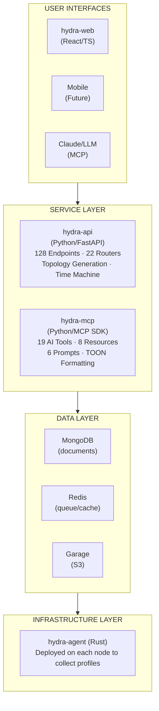

<p align="center">
  
</p>

<h1 align="center">Hydra</h1>

<p align="center">
  <strong>AI-powered infrastructure management platform that creates a queryable knowledge graph of your infrastructure.</strong>
</p>

<p align="center">
  <a href="#features">Features</a> •
  <a href="#quick-start">Quick Start</a> •
  <a href="#architecture">Architecture</a> •
  <a href="#documentation">Documentation</a> •
  <a href="#contributing">Contributing</a>
</p>

<p align="center">
  
  
  
  
  
</p>

---

## What is Hydra?

Hydra transforms how homelabs, smart homes, and small-to-medium infrastructure environments are understood, documented, and operated. Unlike traditional monitoring tools that focus on real-time metrics, Hydra creates a comprehensive **knowledge graph** of your infrastructure that AI models can query, reason about, and help you manage.

**Key Insight:** Monitoring tools tell you _when_ something is wrong. Hydra tells you _what_ your infrastructure actually is.

### The Four Pillars

| Profile | Discover | Query | Control |
|---------|----------|-------|---------|
| Automated collection of infrastructure state | Topology and network mapping | AI-native interface via MCP | Write operations and actions |

## Features

- **Automated Profiling** — Agents collect hardware, software, network, and configuration state
- **Service Discovery** — First-class tracking of systemd, Docker, Kubernetes, and other workloads
- **Network Mapping** — Auto-discovery of network topology, VLANs, and subnets
- **Knowledge Graph** — Infrastructure as interconnected entities with explicit relationships
- **Time Machine** — Navigate historical infrastructure states like version control
- **AI-Native Interface** — Query your infrastructure using natural language via MCP
- **Web Dashboard** — Modern React UI with topology visualization and AI chat

### Node Classes

| Class | Examples |
|-------|----------|
| **Compute** | Servers, VMs, containers, Raspberry Pi |
| **Networking** | Routers, switches, access points, firewalls |
| **IoT** | Sensors, smart devices, hubs |

## Quick Start

### Prerequisites

- Python 3.12+
- Rust 1.75+ (for agent)
- Node.js 22+ (for web)
- [Docker Engine](https://docs.docker.com/engine/install/) with the [Compose plugin](https://docs.docker.com/compose/install/) (`docker compose`)
- MongoDB 7.x
- Redis 7.x
- [Minio](https://docs.min.io/enterprise/aistor-object-store/) | [Garage](https://garagehq.deuxfleurs.fr/documentation/quick-start/) (S3 Compatible Object Storage)

### Docker Compose (Recommended)

```bash
# Clone the repository
git clone https://github.com/hydra-project/hydra.git
cd hydra

# Copy environment configuration
cp .env.example .env
# Edit .env with your settings

# Start all services with local databases
docker compose -f docker compose.dev.yml --profile local-db up -d
```

### Manual Setup

Each component can be set up individually. See the component READMEs for detailed instructions:

| Component | Quick Start |
|-----------|-------------|
| [hydra-api](hydra-api/README.md) | `cd hydra-api && uv sync --extra dev && uv run uvicorn hydra.main:app --port 8080` |
| [hydra-agent](hydra-agent/README.md) | `cd hydra-agent && cargo build --release` |
| [hydra-web](hydra-web/README.md) | `cd hydra-web && npm install && npm run dev` |
| [hydra-mcp](hydra-mcp/README.md) | `cd hydra-mcp && uv pip install -e . && hydra-mcp` |

### Access Points

| Service | URL | Description |
|---------|-----|-------------|
| Web UI | http://localhost:5173 | Dashboard and visualization |
| API | http://localhost:8080/api/v1 | REST API |
| API Docs | http://localhost:8080/api/v1/docs | Swagger UI |
| MCP Server | http://localhost:8081 | AI integration endpoint |

### Install Your First Agent

```bash
curl -sSL https://hydra.local/api/v1/install | bash -s -- \
  --token <REGISTRATION_TOKEN> --node-id my-server
```

## Architecture



### Components

| Component | Technology | Purpose |
|-----------|------------|---------|
| **hydra-api** | Python 3.11+ / FastAPI | Central REST API, authentication, CRUD, topology generation |
| **hydra-agent** | Rust | Lightweight profiling agent deployed on infrastructure nodes |
| **hydra-mcp** | Python / MCP SDK | AI interface layer for LLM interaction |
| **hydra-web** | React 18 / TypeScript | Web dashboard with topology visualization |

### Data Storage

| Store | Technology | Purpose |
|-------|------------|---------|
| **MongoDB** | MongoDB 7.0 | Document storage for entities, profiles, and audit logs |
| **Redis** | Redis 7 | Command queue, caching, rate limiting |
| **Garage** | S3-compatible | Object storage for agent binary distribution |

## AI Integration (MCP)

Hydra exposes infrastructure through the [Model Context Protocol](https://modelcontextprotocol.io/), enabling AI assistants like Claude to interact with your infrastructure.

### Example Conversation

```
User: "My Plex server seems slow. Can you help?"

Claude uses MCP tools:
  → search_services("plex") → Finds plex on media-server
  → get_node("media-server") → Gets node details
  → compare_profiles("media-server") → Checks recent changes

Claude: "I found the issue! Three days ago, you added a new
transcoding container competing for CPU. Recommendations:
1. Increase Plex container CPU allocation
2. Move transcoder to docker-host-02 (has spare capacity)"
```

### Claude Desktop Integration

```json
{
  "mcpServers": {
    "hydra": {
      "command": "hydra-mcp",
      "env": {
        "HYDRA_MCP_API_URL": "http://your-hydra-api:8080/api/v1",
        "HYDRA_MCP_API_KEY": "your-api-key"
      }
    }
  }
}
```

See [hydra-mcp/README.md](hydra-mcp/README.md) for full MCP documentation including available tools, resources, and prompts.

## Documentation

### Component Documentation

| Component | Description |
|-----------|-------------|
| [hydra-api/README.md](hydra-api/README.md) | API service setup, endpoints, configuration |
| [hydra-agent/README.md](hydra-agent/README.md) | Agent building, deployment, CLI reference |
| [hydra-web/README.md](hydra-web/README.md) | Web dashboard development and features |
| [hydra-mcp/README.md](hydra-mcp/README.md) | MCP service, tools, resources, Claude integration |

### Technical Documentation

| Document | Description |
|----------|-------------|
| [Product Documentation](resources/docs/main/Hydra%20Product%20Documentation%20v0.3.0.md) | Vision, user journeys, use cases |
| [Technical Documentation](resources/docs/main/Hydra%20Technical%20Documentation%20v0.3.0.md) | Architecture, schemas, implementation details |
| [API Reference](resources/docs/main/Hydra%20API%20Reference%20v0.3.0.md) | All 128 endpoints with request/response examples |


## Development

### Testing

```bash
# API tests
cd hydra-api && uv run pytest --cov=hydra

# Agent tests
cd hydra-agent && cargo test

# Web tests
cd hydra-web && npm run test

# MCP tests
cd hydra-mcp && pytest
```

### Code Quality

```bash
# API
cd hydra-api && uv run ruff check . && uv run ruff format . && uv run mypy hydra

# Rust (Agent)
cargo clippy && cargo fmt

# TypeScript (Web)
npm run lint && npm run typecheck
```

### Project Structure

```
hydra/
├── hydra-api/           # FastAPI REST service (128 endpoints, 22 routers)
├── hydra-agent/         # Rust profiling agent (cross-platform)
├── hydra-web/           # React dashboard (31 pages)
├── hydra-mcp/           # MCP AI interface (19 tools, 8 resources, 6 prompts)
└── resources/
    ├── assets/          # Logos and images
    └── docs/main/       # Technical documentation
```

## Roadmap

### Current (v0.3.0)

- Node registration and profiling
- Service discovery and tracking
- Network auto-discovery
- Topology generation (Infrastructure, Network, Service modes)
- Time Machine
- Web dashboard with AI chat integration
- MCP service with 19 AI tools, 8 resources, 6 prompts

### Planned

- Time Machine calendar view and enhanced timeline UI
- Write operations and command execution
- Home Assistant integration
- Chat WebSocket streaming
- Mobile applications (React Native)

## Contributing

We welcome contributions! Please see our contributing guidelines (coming soon).

### Quick Contribution Guide

1. Fork the repository
2. Create a feature branch (`git checkout -b feature/amazing-feature`)
3. Make your changes
4. Run relevant tests (`cd hydra-api && uv run pytest`, `cargo test`, `npm test`)
5. Commit your changes (`git commit -m 'Add amazing feature'`)
6. Push to the branch (`git push origin feature/amazing-feature`)
7. Open a Pull Request

### Development Setup

```bash
# Clone your fork
git clone https://github.com/YOUR_USERNAME/hydra.git
cd hydra

# Install pre-commit hooks
uv tool install pre-commit
pre-commit install

# Start development databases
docker compose -f docker compose.dev.yml --profile local-db up -d mongodb redis
```

## Community

- **Issues:** [GitHub Issues](https://github.com/hydra-project/hydra/issues)
- **Discussions:** [GitHub Discussions](https://github.com/hydra-project/hydra/discussions)

## License

Hydra is licensed under the [Apache License 2.0](LICENSE).

```
Copyright 2025 Hydra Project

Licensed under the Apache License, Version 2.0 (the "License");
you may not use this file except in compliance with the License.
You may obtain a copy of the License at

    http://www.apache.org/licenses/LICENSE-2.0
```

---

<p align="center">
  <sub>Built with ❤️ for the homelab community</sub>
</p>
