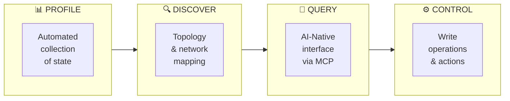
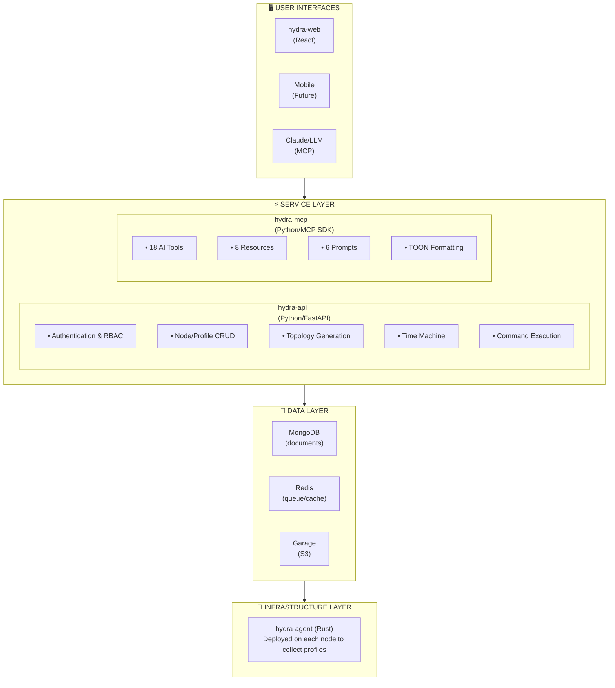

<p align="center">
  
</p>

<h1 align="center">Hydra</h1>

<p align="center">
  <strong>AI-powered infrastructure management platform that creates a queryable knowledge graph of your infrastructure.</strong>
</p>

<p align="center">
  <a href="#features">Features</a> •
  <a href="#quick-start">Quick Start</a> •
  <a href="#architecture">Architecture</a> •
  <a href="#documentation">Documentation</a> •
  <a href="#contributing">Contributing</a>
</p>

<p align="center">
  
  
  
  
  
</p>

---

## What is Hydra?

Hydra transforms how homelabs, smart homes, and small-to-medium infrastructure environments are understood, documented, and operated. Unlike traditional monitoring tools that focus on real-time metrics, Hydra creates a comprehensive **knowledge graph** of your infrastructure that AI models can query, reason about, and help you manage.

**Key Insight:** Monitoring tools tell you _when_ something is wrong. Hydra tells you _what_ your infrastructure actually is - and when something is wrong (on a high level).

### The Four Pillars



## Features

### Core Capabilities

- **Automated Profiling** — Agents collect hardware, software, network, and configuration state without manual intervention
- **Service Discovery** — First-class tracking of systemd, Docker, Kubernetes, and other workloads
- **Network Mapping** — Auto-discovery of network topology, VLANs, and subnets
- **Knowledge Graph** — Infrastructure as interconnected entities with explicit relationships
- **Time Machine** — Navigate historical infrastructure states like version control for your infrastructure
- **AI-Native Interface** — Query your infrastructure using natural language via Model Context Protocol (MCP)

### Node Classes

| Class | Examples | Profile Data |
|-------|----------|--------------|
| **Compute** | Servers, VMs, containers, Raspberry Pi | Hardware specs, OS, packages, services, users |
| **Networking** | Routers, switches, access points, firewalls | Interfaces, VLANs, routing, firewall zones |
| **IoT** | Sensors, smart devices, hubs | Capabilities, connectivity, integrations |

### Why Hydra?

| For Homelabbers | For Smart Home Users | For Small Businesses |
|-----------------|---------------------|---------------------|
| "What can I run on my infrastructure?" | "What devices do I have?" | "Document our setup automatically" |
| "Help me plan this migration" | "Why is my network slow?" | "What breaks if this server fails?" |
| "Generate documentation for my setup" | "Control my home with AI" | "Audit for compliance" |

## Quick Start

### Prerequisites

- Python 3.11+
- Rust 1.75+
- Node.js 18+
- MongoDB 7.x
- Redis 7.x
- Garage/Minio (S3 Compatible Object storage)

### Option 1: Docker Compose (Recommended)

```bash
# Clone the repository
git clone https://github.com/hydra-project/hydra.git
cd hydra

# Copy environment configuration
cp .env.example .env
# Edit .env with your settings

# Start all services with local databases
docker-compose -f docker-compose.dev.yml --profile local-db up -d

# Or without local databases (using external MongoDB/Redis)
docker-compose -f docker-compose.dev.yml up -d
```

### Option 2: Manual Setup

<details>
<summary><strong>hydra-api (Python/FastAPI)</strong></summary>

```bash
cd hydra-api

# Using uv (recommended)
uv venv && source .venv/bin/activate
uv pip install -e ".[dev]"

# Or with pip
python -m venv .venv && source .venv/bin/activate
pip install -e ".[dev]"

# Run the API
uvicorn hydra.main:app --reload --host 0.0.0.0 --port 8080
```
</details>

<details>
<summary><strong>hydra-agent (Rust)</strong></summary>

```bash
cd hydra-agent

# Build the agent
cargo build --release

# Register with the API
./target/release/hydra-agent --register --token <REGISTRATION_TOKEN>

# Run the agent
./target/release/hydra-agent --config /etc/hydra/agent.toml
```
</details>

<details>
<summary><strong>hydra-web (React/TypeScript)</strong></summary>

```bash
cd hydra-web

# Install dependencies
npm install

# Configure API endpoint
cp .env.example .env
# Edit VITE_API_URL

# Start development server
npm run dev
```
</details>

<details>
<summary><strong>hydra-mcp (Python/MCP SDK)</strong></summary>

```bash
cd hydra-mcp

# Install
uv pip install -e .

# Run the MCP server
hydra-mcp
```
</details>

### Access Points

| Service | URL | Description |
|---------|-----|-------------|
| Web UI | http://localhost:5173 | Dashboard and visualization |
| API | http://localhost:8080/api/v1 | REST API |
| API Docs | http://localhost:8080/api/v1/docs | Swagger UI |

### Install Your First Agent

```bash
# One-liner installation on a target node
curl -sSL https://hydra.local/api/v1/install | bash -s -- \
  --token <REGISTRATION_TOKEN> --node-id my-server
```

## Architecture



### Components

| Component | Technology | Purpose |
|-----------|------------|---------|
| **hydra-api** | Python 3.11+ / FastAPI | Central REST API, authentication, CRUD, topology generation, Time Machine |
| **hydra-agent** | Rust | Lightweight profiling agent deployed on infrastructure nodes |
| **hydra-mcp** | Python / MCP SDK | AI interface layer exposing tools and resources for LLM interaction |
| **hydra-web** | React 18 / TypeScript | Web dashboard, topology visualization, Time Machine UI |

### Data Storage

| Store | Technology | Purpose |
|-------|------------|---------|
| **MongoDB** | MongoDB 7.0 | Document storage for all entities, profiles, and audit logs |
| **Redis** | Redis 7 | Command queue, caching, rate limiting, sessions |
| **Garage** | S3-compatible | Object storage for agent binary distribution |

## Key Concepts

### Profile Versioning

Profiles use hexadecimal versioning that reflects change magnitude:

```
Format: Ex-W.X.Y.Z

E = Epoch (breaking changes)
W = Massive (>75% sections changed)
X = Major (>50% sections changed)
Y = Moderate (>25% sections changed)
Z = Minor (any section changed)

Examples:
E0-0.0.0.1  → First profile
E0-0.0.1.4  → 4 minor changes after 1 moderate change
E0-0.1.2.3  → Mix of changes over time
```

### Service ID Format

```
svc-<name>-<hash>

Format: svc-<sanitized_name>-<4 char hash>
Hash is generated from: nodeId + runtime + name (ensures global uniqueness)

Examples:
svc-mongodb-a1b2
svc-nginx-c3d4
svc-api-gateway-e5f6
```

### RBAC Roles

| Role | Level | Access |
|------|-------|--------|
| **admin** | 100 | Full access to all resources |
| **operator** | 50 | Infrastructure management without user admin |
| **viewer** | 25 | Read-only access |
| **family** | 10 | IoT controls only |
| **agent** | 0 | Own node profile/commands only |

## AI Integration (MCP)

Hydra exposes infrastructure through the [Model Context Protocol](https://modelcontextprotocol.io/), enabling AI assistants like Claude to interact with your infrastructure.

### Example Conversation

```
User: "My Plex server seems slow. Can you help?"

Claude uses MCP tools:
  → search_services("plex") → Finds plex on media-server
  → get_node("media-server") → Gets node details
  → compare_profiles("media-server") → Checks recent changes

Claude: "I found the issue! Three days ago, you added a new
transcoding container competing for CPU. Recommendations:
1. Increase Plex container CPU allocation
2. Move transcoder to docker-host-02 (has spare capacity)
3. Consider GPU passthrough for hardware transcoding"
```

### Available Tools

| Category | Tools |
|----------|-------|
| **Queries** | `list_nodes`, `get_node`, `get_node_profile`, `list_services`, `get_service`, `list_groups`, `list_networks`, `get_topology`, `search_infrastructure` |
| **Analytics** | `get_capacity`, `compare_profiles`, `query_infrastructure` |
| **Time Machine** | `time_machine_node`, `time_machine_topology` |
| **Control** | `control_service`, `control_device` |

### Claude Desktop Integration

```json
{
  "mcpServers": {
    "hydra": {
      "command": "hydra-mcp",
      "env": {
        "HYDRA_MCP_API_URL": "http://your-hydra-api:8080/api/v1",
        "HYDRA_MCP_API_KEY": "your-api-key"
      }
    }
  }
}
```

### TOON Format

All MCP responses use [TOON](https://github.com/toon-format/toon-python) (Text-Oriented Object Notation) for 30-60% token reduction compared to JSON:

```
# Tabular arrays
[3,]{nodeId,class,status}:
proxmox-01,compute,active
opnsense-gw,networking,active
ha-core,iot,active

# Nested structures
node:
  nodeId: proxmox-01
  class: compute
  services[5]: nginx,mongodb,redis,plex,grafana
```

## Configuration

### Environment Variables

#### hydra-api

| Variable | Description | Default |
|----------|-------------|---------|
| `HYDRA_MONGODB_URI` | MongoDB connection string | - |
| `HYDRA_MONGODB_DATABASE` | Database name | `hydra` |
| `HYDRA_REDIS_URL` | Redis connection URL | - |
| `HYDRA_JWT_SECRET` | JWT signing secret | - |
| `HYDRA_JWT_EXPIRE_MINUTES` | Token expiration | `60` |

#### hydra-mcp

| Variable | Description | Default |
|----------|-------------|---------|
| `HYDRA_MCP_API_URL` | Hydra API base URL | `http://localhost:8080/api/v1` |
| `HYDRA_MCP_API_KEY` | API key for authentication | - |
| `HYDRA_MCP_TOON_INDENT` | TOON indentation | `2` |

#### hydra-web

| Variable | Description | Default |
|----------|-------------|---------|
| `VITE_API_URL` | Hydra API base URL | `http://localhost:8080/api/v1` |

### Agent Configuration

```toml
# /etc/hydra/agent.toml

[api]
url = "https://hydra.example.com/api/v1"
credentials_file = "/etc/hydra/credentials.json"

[node]
node_id = "my-server-01"
class = "compute"
node_type = "physical"
tags = ["production", "web"]

[collection]
level = "neutral"  # shallow, neutral, or deep
collectors = ["hardware", "network", "storage", "software"]

[schedule]
enabled = true
interval_seconds = 86400  # 24 hours
```

## Web Interface

### Dashboard
Infrastructure overview with capacity gauges, activity feed, and mini topology.

### Topology Viewer
Interactive graph visualization of network and infrastructure relationships using ReactFlow.

### Time Machine
Navigate historical infrastructure states with timeline scrubbing and state comparison.

### Admin Panel
User management, registration tokens, API keys, and audit logs.

## Performance Targets

| Metric | Target |
|--------|--------|
| API response time | < 300ms for single-entity queries |
| Profile processing | < 500ms |
| Topology generation | < 5s for 100 nodes |
| Agent memory footprint | < 50MB RSS |
| Web UI initial load | < 3s |

## Documentation

Detailed documentation is available in the `docs/` folder:

| Document | Description |
|----------|-------------|
| [Product Documentation](docs/Hydra%20Product%20Documentation%20v0.3.0.md) | Vision, user journeys, use cases, UI design |
| [Technical Documentation](docs/Hydra%20Technical%20Documentation%20v0.3.0.md) | Architecture, schemas, implementation details |
| [API Reference](docs/Hydra%20API%20Reference%20v0.3.0.md) | All endpoints with request/response examples |
| [Development Roadmap](docs/Hydra%20Development%20Roadmap%20v0.3.0.md) | Phases and task breakdown |

### Component READMEs

- [hydra-api/README.md](hydra-api/README.md) — API service setup and development
- [hydra-agent/README.md](hydra-agent/README.md) — Agent building and deployment
- [hydra-web/README.md](hydra-web/README.md) — Web dashboard development
- [hydra-mcp/README.md](hydra-mcp/README.md) — MCP service and AI integration

## Development

### Testing

```bash
# API tests
cd hydra-api && pytest --cov=hydra

# Agent tests
cd hydra-agent && cargo test

# Web tests
cd hydra-web && npm run test

# MCP tests
cd hydra-mcp && pytest
```

### Code Quality

```bash
# Python (API & MCP)
ruff check . && ruff format . && mypy hydra-api/hydra hydra-mcp/hydra

# Rust (Agent)
cargo clippy && cargo fmt

# TypeScript (Web)
npm run lint && npm run typecheck
```

### Project Structure

```
hydra/
├── hydra-api/           # FastAPI REST service
│   ├── hydra/             # Source code
│   │   ├── api/         # API surface area
│   │   │   └── v1/      # API v1 implementation
│   │   ├── core/        # Shared config and logging
│   │   └── db/          # Database clients
│   └── tests/           # Test suite
├── hydra-agent/         # Rust profiling agent
│   └── src/
│       ├── collectors/  # System data collectors
│       ├── api/         # API client
│       └── config/      # Configuration
├── hydra-web/           # React dashboard
│   └── src/
│       ├── api/         # TanStack Query hooks
│       ├── components/  # React components
│       ├── pages/       # Route components
│       └── stores/      # Zustand stores
├── hydra-mcp/           # MCP AI interface
│   └── hydra/
│       ├── server.py    # MCP server
│       ├── client.py    # API client
│       └── toon.py      # TOON formatter
└── docs/                # Documentation
```

## Roadmap

### Current (v0.3.0)
- Node registration and profiling
- Service discovery and tracking
- Network auto-discovery
- Topology generation
- Time Machine
- Web dashboard
- MCP service with AI tools

### Planned
- Write operations and command execution
- Home Assistant integration
- Mobile applications (React Native)
- Prometheus metrics export
- SSO/OIDC authentication

## Contributing

We welcome contributions! Please see our contributing guidelines (coming soon).

### Quick Contribution Guide

1. Fork the repository
2. Create a feature branch (`git checkout -b feature/amazing-feature`)
3. Make your changes
4. Run tests (`pytest` / `cargo test` / `npm test`)
5. Commit your changes (`git commit -m 'Add amazing feature'`)
6. Push to the branch (`git push origin feature/amazing-feature`)
7. Open a Pull Request

### Development Setup

```bash
# Clone your fork
git clone https://github.com/YOUR_USERNAME/hydra.git
cd hydra

# Install pre-commit hooks
pip install pre-commit
pre-commit install

# Start development databases
docker-compose -f docker-compose.dev.yml --profile local-db up -d mongodb redis
```

## Community

- **Issues:** [GitHub Issues](https://github.com/hydra-project/hydra/issues)
- **Discussions:** [GitHub Discussions](https://github.com/hydra-project/hydra/discussions)

## License

Hydra is licensed under the [Apache License 2.0](LICENSE).

```
Copyright 2025 Hydra Project

Licensed under the Apache License, Version 2.0 (the "License");
you may not use this file except in compliance with the License.
You may obtain a copy of the License at

    http://www.apache.org/licenses/LICENSE-2.0

Unless required by applicable law or agreed to in writing, software
distributed under the License is distributed on an "AS IS" BASIS,
WITHOUT WARRANTIES OR CONDITIONS OF ANY KIND, either express or implied.
See the License for the specific language governing permissions and
limitations under the License.
```

---

<p align="center">
  <sub>Built with ❤️ for the homelab community</sub>
</p>
