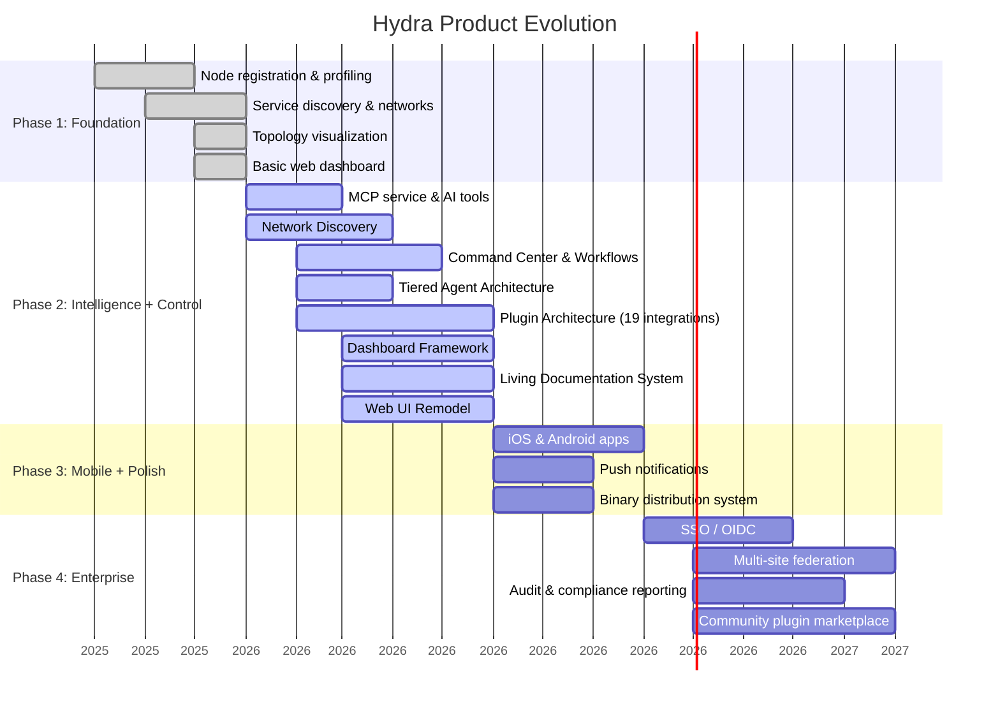
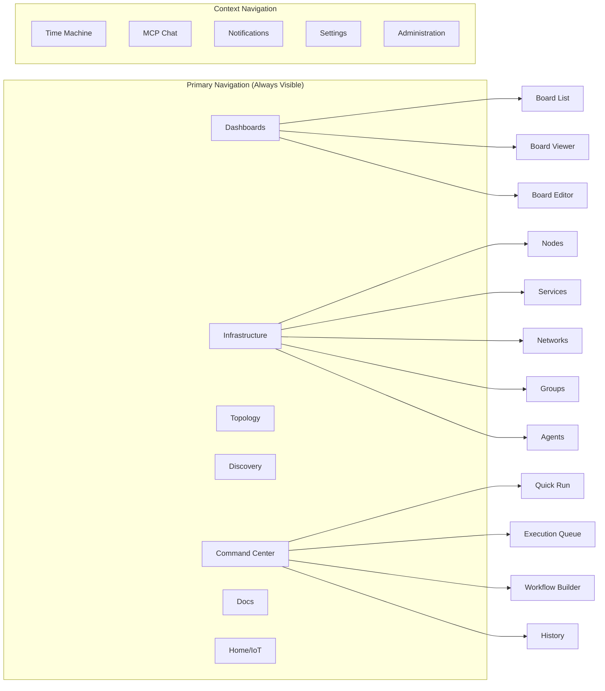
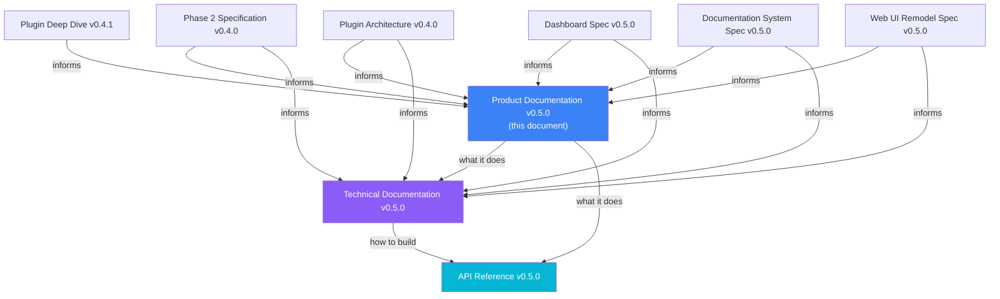

# Hydra Product Documentation

> **Version:** 0.5.0  
> **Last Updated:** 2026-02-24  
> **Status:** Comprehensive Product Specification — Phase 2 Complete

---

## Table of Contents

1. [Executive Summary](#1-executive-summary)
2. [Product Vision & Strategy](#2-product-vision--strategy)
3. [Target Users & Personas](#3-target-users--personas)
4. [Core Capabilities](#4-core-capabilities)
5. [System Components](#5-system-components)
6. [User Journeys](#6-user-journeys)
7. [Use Cases](#7-use-cases)
8. [Web Application Design](#8-web-application-design)
9. [Plugin & Integration Architecture](#9-plugin--integration-architecture)
10. [Dashboard Framework](#10-dashboard-framework)
11. [Living Documentation System](#11-living-documentation-system)
12. [Command Center & Workflows](#12-command-center--workflows)
13. [Network Discovery](#13-network-discovery)
14. [Agent Architecture](#14-agent-architecture)
15. [Mobile Application](#15-mobile-application)
16. [Security & Access Control](#16-security--access-control)
17. [Operational Features](#17-operational-features)
18. [Success Metrics](#18-success-metrics)
19. [Competitive Positioning](#19-competitive-positioning)
20. [Open Source Strategy](#20-open-source-strategy)
21. [Appendices](#appendices)

---

## 1. Executive Summary

### 1.1 What is Hydra?

Hydra is an **AI-powered infrastructure management platform** that transforms how homelabs, smart homes, and small-to-medium infrastructure environments are understood, documented, and operated. Unlike traditional monitoring tools that focus on real-time metrics, Hydra creates a comprehensive **knowledge graph** of your infrastructure that AI models can query, reason about, and act upon.

Hydra is built around four pillars — **Profile**, **Discover**, **Query**, and **Control** — delivered across four service components, a 19-integration plugin system, and a customizable dashboard framework.

### 1.2 The Core Insight

Modern infrastructure management suffers from a fundamental disconnect: monitoring tools tell you _when_ something is wrong, but not _what_ your infrastructure actually is. Hydra bridges this gap by:

- **Profiling** infrastructure state rather than monitoring metrics
- **Discovering** devices proactively across network segments
- **Building relationships** between nodes, services, networks, and configurations
- **Enabling AI interaction** through the Model Context Protocol (MCP)
- **Preserving history** with Time Machine for state navigation
- **Controlling infrastructure** through a three-layer command execution system with safety guardrails
- **Extending capabilities** through a provider-scoped plugin architecture
- **Documenting automatically** via a living documentation system that writes itself from profiled data

### 1.3 Key Value Propositions

| For Homelabbers | For Smart Home Users | For Small Businesses |
|---|---|---|
| "What can I run on my infrastructure?" | "What devices do I have and how are they connected?" | "Document our entire setup without manual effort" |
| "Help me plan this migration" | "Why is my network slow?" | "What would break if this server went down?" |
| "Generate documentation for my setup" | "Control my smart home with AI" | "Audit our infrastructure for compliance" |
| "Run my safe-restart workflow on nginx" | "Build me a room-by-room dashboard" | "Scan for unknown devices on our network" |
| "What changed since last Tuesday?" | "Why didn't my morning routine run?" | "Restart the CRM service — show me the logs first" |

### 1.4 The Four Pillars

```
┌─────────────────────────────────────────────────────────────────────────────┐
│                           HYDRA FOUR PILLARS                                │
├─────────────────────────────────────────────────────────────────────────────┤
│                                                                             │
│   ┌─────────────┐    ┌─────────────┐    ┌─────────────┐    ┌─────────────┐ │
│   │   PROFILE   │    │  DISCOVER   │    │    QUERY    │    │   CONTROL   │ │
│   │             │    │             │    │             │    │             │ │
│   │  Automated  │    │  Network    │    │  AI-Native  │    │  Commands,  │ │
│   │  collection │───▶│  scanning,  │───▶│  interface  │───▶│  Executions │ │
│   │  of state   │    │  topology   │    │  via MCP    │    │  & Workflows│ │
│   │  + plugins  │    │  mapping    │    │  + docs     │    │  + plugins  │ │
│   │             │    │             │    │             │    │             │ │
│   └─────────────┘    └─────────────┘    └─────────────┘    └─────────────┘ │
│                                                                             │
│   19 Integrations ────────── extend every pillar ──────────────────────►  │
│   Customizable Dashboards ── visualize every pillar ───────────────────►  │
│   Living Documentation ───── document every pillar ────────────────────►  │
│                                                                             │
└─────────────────────────────────────────────────────────────────────────────┘
```

---

## 2. Product Vision & Strategy

### 2.1 Vision Statement

> "Make every infrastructure — from a Raspberry Pi cluster to a small business data center — as queryable and manageable as asking a knowledgeable colleague."

### 2.2 Strategic Principles

**1. Profiling Over Monitoring**

- Capture infrastructure "DNA" rather than vital signs
- Focus on structure, configuration, and relationships
- Enable point-in-time snapshots over continuous streams

**2. AI-First Design**

- Every data structure optimized for LLM consumption
- MCP as the primary interface for intelligent operations
- Natural language as the default interaction mode

**3. Knowledge Graph Architecture**

- Infrastructure as interconnected entities
- Explicit relationships between nodes, services, networks
- Graph-native queries and visualizations

**4. Time as a First-Class Dimension**

- Every state is historical and comparable
- Navigate infrastructure state like version control
- Understand evolution, not just current state

**5. Progressive Enhancement**

- Start with read-only profiling (safe)
- Add write operations incrementally (controlled)
- Enable automation with appropriate safeguards

**6. Plugin-Extended, Not Plugin-Dependent**

- Core functionality works without any integration enabled
- Plugins enrich, discover, execute, and visualize — but never replace
- Provider-scoped separation: Docker ≠ Podman, pfSense ≠ OPNsense

### 2.3 Product Evolution



---

## 3. Target Users & Personas

### 3.1 Primary Persona: The Homelabber (Alex)

**Demographics:**

- Age: 25-45
- Technical background: IT professional, developer, or enthusiast
- Infrastructure: 5-50 nodes including Proxmox/VMware hosts, containers, NAS, networking gear

**Goals:**

- Understand and document complex infrastructure
- Plan capacity for new projects
- Troubleshoot issues faster with AI assistance
- Automate routine maintenance
- Build custom dashboards for different infrastructure views

**Pain Points:**

- "I forget what's running where after a few months"
- "Documentation is always out of date"
- "I spend hours figuring out dependencies before changes"
- "Restarting services means SSH-ing into five different boxes"

**Hydra Value:**

- Auto-generated, always-current documentation
- AI-assisted capacity planning and troubleshooting
- Visual topology for understanding relationships
- Time Machine for "what changed?" investigations
- Command Center for managing services across all nodes from one place
- Custom dashboards: Docker fleet view, Proxmox cluster view, capacity planning board
- Plugin enrichment: Proxmox VM states, Docker container details, Prometheus metrics

### 3.2 Secondary Persona: Smart Home Enthusiast (Jordan)

**Demographics:**

- Age: 30-55
- Technical background: Varying, uses Home Assistant
- Infrastructure: Router, IoT hub, 20-100+ smart devices

**Goals:**

- Understand all connected devices
- Control smart home with natural language
- Troubleshoot connectivity issues
- Plan home automation improvements
- Give family members a simple control interface

**Pain Points:**

- "I don't know all the devices on my network"
- "Something broke after the last update"
- "My family finds the apps too complicated"

**Hydra Value:**

- Complete device inventory with network visualization
- Family-friendly dashboard with room-by-room IoT controls
- AI assistant for "why isn't the living room light responding?"
- Network Discovery to find unknown devices on the IoT VLAN
- Wall-mounted kiosk dashboard for at-a-glance status
- Mobile app for on-the-go management

### 3.3 Tertiary Persona: Small Business IT (Taylor)

**Demographics:**

- Age: 30-50
- Role: IT manager, sole IT person, or MSP
- Infrastructure: 10-100 nodes across office and cloud

**Goals:**

- Document infrastructure for compliance
- Plan migrations and upgrades
- Provide capacity reports to leadership
- Reduce troubleshooting time
- Delegate safe operations to junior staff

**Pain Points:**

- "I inherited this infrastructure with no documentation"
- "Audits require manual inventory gathering"
- "I need to justify infrastructure spending"
- "Junior staff can't safely restart services"

**Hydra Value:**

- Automatic infrastructure documentation
- Compliance-ready reports and audit logs
- AI-generated capacity and cost analysis
- Time Machine for change tracking
- RBAC with operator role for junior staff (safe operations only, no node reboots)
- Saved workflows that junior staff can trigger without understanding the internals

---

## 4. Core Capabilities

### 4.1 Capability Matrix

| Capability | Description | User Benefit |
|---|---|---|
| **Node Profiling** | Automated collection of hardware, software, network, and configuration state | Always-current infrastructure inventory |
| **Service Discovery** | Detection and tracking of systemd, Docker, Kubernetes workloads | Know what's running everywhere |
| **Network Discovery** | Proactive scanning to find devices before registration | "What's on my network that Hydra doesn't know about?" |
| **Network Mapping** | Auto-discovery of network topology, VLANs, subnets | Visual understanding of connectivity |
| **Topology Visualization** | Interactive graph views of infrastructure relationships | See dependencies at a glance |
| **Time Machine** | Historical navigation of infrastructure state | Answer "what changed?" instantly |
| **MCP Interface** | AI-native API for LLM integration with tools, resources, and prompts | Natural language infrastructure queries |
| **Command Center** | Three-layer command execution: Commands → Executions → Workflows | Take controlled action across your infrastructure |
| **Plugin System** | 19 provider-scoped integrations across six touchpoints | Deep integration with Proxmox, Docker, Home Assistant, and more |
| **Dashboard Framework** | Customizable boards with 75+ widget types from core and plugin sources | Build exactly the view you need |
| **Living Documentation** | Auto-generated and manually-authored infrastructure docs in a unified portal | Documentation that writes itself |
| **Group Management** | Flexible logical grouping with selectors | Organize infrastructure your way |
| **Access Control** | Five-role RBAC with per-command safety controls | Secure multi-user access |
| **Home Assistant** | Bidirectional IoT integration via plugin | Unified smart home management |
| **Notification System** | 5-tier real-time alerts with dedup, escalation, auto-resolve | Never miss critical infrastructure events |
| **AI Chat** | Multi-provider LLM chat with MCP tool calling | Natural language infrastructure interaction |
| **Known Services** | Service registry and allow-listing | Reduce noise from unknown service alerts |
| **Remote Installation** | Deploy agents to discovered nodes via SSH | Onboard infrastructure from the web UI |

### 4.2 Node Classes

Hydra classifies all infrastructure into three node classes:

**Compute Nodes**

- Physical: Bare metal servers, workstations, SBCs (Raspberry Pi)
- Logical: VMs, LXC containers, Docker hosts, Kubernetes nodes
- Profiles include: hardware specs, OS details, packages, services, users, configs
- Plugin enrichment: Proxmox cluster state, Docker container inventory, Prometheus metrics

**Networking Nodes**

- Types: Routers, switches, access points, firewalls, load balancers
- Profiles include: interfaces, VLANs, routing tables, firewall zones, DHCP/DNS
- Plugin enrichment: UniFi client stats, pfSense/OPNsense rule counts, SNMP interface metrics

**IoT Nodes**

- Categories: Climate, lighting, security, sensors, appliances
- Profiles include: device info, connectivity, capabilities, integrations, state
- Primary source: Home Assistant integration, with network discovery for drift detection

### 4.3 Profile Versioning

Hydra uses a unique hexadecimal versioning system that reflects the magnitude of infrastructure changes:

```
Format: Ex-W.X.Y.Z

E = Epoch (manual increment for breaking changes)
W = Massive change (>75% of sections changed)
X = Major change (>50% of sections changed)
Y = Moderate change (>25% of sections changed)
Z = Minor change (any section changed)

Examples:
E0-0.0.0.1  → First profile
E0-0.0.0.F  → 15 minor changes
E0-0.0.1.0  → Moderate change after Z overflow
E0-0.1.2.3  → Mix of changes over time
E1-0.0.0.0  → New epoch (breaking schema change)
```

This enables:

- Ultra-fast diff calculations using pre-computed Blake2b hashes
- Instant detection of identical profiles (no new version created)
- Semantic understanding of change magnitude
- Per-section hash comparison for efficient partial updates

---

## 5. System Components

### 5.1 Architecture Overview

```
┌─────────────────────────────────────────────────────────────────────────────┐
│                           HYDRA ARCHITECTURE                                │
├─────────────────────────────────────────────────────────────────────────────┤
│                                                                             │
│  ┌────────────────────────────────────────────────────────────────────────┐│
│  │                        USER INTERFACES                                 ││
│  │  ┌──────────────┐  ┌──────────────┐  ┌──────────────┐  ┌────────────┐ ││
│  │  │   Web App    │  │  Mobile App  │  │  Claude/LLM  │  │    CLI     │ ││
│  │  │  (React/TS)  │  │ (React Nat.) │  │ (MCP Client) │  │  (Agent)   │ ││
│  │  │              │  │              │  │              │  │            │ ││
│  │  │ • Dashboards │  │ • Monitoring │  │ • Internal   │  │ • Profile  │ ││
│  │  │ • Cmd Center │  │ • IoT Ctrl   │  │   (Web Chat) │  │ • Execute  │ ││
│  │  │ • Doc Portal │  │ • Notif.     │  │ • External   │  │ • Report   │ ││
│  │  │ • Discovery  │  │ • Chat       │  │   (Desktop)  │  │            │ ││
│  │  └──────┬───────┘  └──────┬───────┘  └──────┬───────┘  └──────┬─────┘ ││
│  └─────────┼─────────────────┼─────────────────┼─────────────────┼────────┘│
│            │                 │                 │                 │         │
│            ▼                 ▼                 ▼                 ▼         │
│  ┌────────────────────────────────────────────────────────────────────────┐│
│  │                         SERVICE LAYER                                  ││
│  │  ┌──────────────────────────────┐  ┌──────────────────────────────┐   ││
│  │  │        hydra-api             │  │       hydra-mcp              │   ││
│  │  │    (Python/FastAPI)          │  │    (Python/MCP SDK)          │   ││
│  │  │                              │  │                              │   ││
│  │  │  • Authentication & RBAC     │  │  • AI Tools & Resources      │   ││
│  │  │  • Node/Profile CRUD         │  │  • TOON Formatting           │   ││
│  │  │  • Service Management        │  │  • Prompts Library           │   ││
│  │  │  • Network Discovery         │  │  • API Client Wrapper        │   ││
│  │  │  • Topology Generation       │  │  • Source-aware permissions   │   ││
│  │  │  • Time Machine              │  │                              │   ││
│  │  │  • Command Execution Engine  │  │                              │   ││
│  │  │  • Workflow Orchestrator     │  │                              │   ││
│  │  │  • Plugin Registry & Drivers │  │                              │   ││
│  │  │  • Dashboard/Board CRUD      │  │                              │   ││
│  │  │  • Doc Generation Pipeline   │  │                              │   ││
│  │  │  • Notification System       │  │                              │   ││
│  │  └──────────────┬───────────────┘  └──────────────┬───────────────┘   ││
│  └─────────────────┼─────────────────────────────────┼────────────────────┘│
│                    │                                 │                     │
│                    ▼                                 │                     │
│  ┌────────────────────────────────────────────────────────────────────────┐│
│  │                         DATA LAYER                                     ││
│  │  ┌──────────────────────────────────────────────────────────────────┐ ││
│  │  │                        MongoDB                                    │ ││
│  │  │                                                                    │ ││
│  │  │  Core:  nodes · profiles · profile_meta · services · groups       │ ││
│  │  │         networks · topologies · users · api_keys · tokens         │ ││
│  │  │                                                                    │ ││
│  │  │  Ops:   commands · executions · workflows · workflow_runs         │ ││
│  │  │         discovered_nodes · discovery_scans                        │ ││
│  │  │                                                                    │ ││
│  │  │  Content: boards · documents · notifications · chat_sessions      │ ││
│  │  │                                                                    │ ││
│  │  │  System: plugins · plugin_configs · integrations · audit_log      │ ││
│  │  │          mcp_clients · settings                                   │ ││
│  │  │                                                                    │ ││
│  │  └──────────────────────────────────────────────────────────────────┘ ││
│  └────────────────────────────────────────────────────────────────────────┘│
│                                                                             │
│  ┌────────────────────────────────────────────────────────────────────────┐│
│  │                      INFRASTRUCTURE LAYER                              ││
│  │                                                                        ││
│  │  ┌──────────────┐  ┌──────────────┐  ┌──────────────┐                 ││
│  │  │ hydra-agent  │  │ hydra-agent  │  │ hydra-agent  │  ...            ││
│  │  │  (Rust)      │  │  (Rust)      │  │  (Rust)      │                 ││
│  │  │  max tier    │  │  normal tier │  │  lite tier   │                 ││
│  │  │              │  │              │  │              │                 ││
│  │  │  Hypervisor  │  │  General     │  │  SBC /       │                 ││
│  │  │  Hub node    │  │  compute     │  │  Single-use  │                 ││
│  │  └──────────────┘  └──────────────┘  └──────────────┘                 ││
│  │                                                                        ││
│  │  ┌──────────────────────────────────────────────────────────────────┐ ││
│  │  │              EXTERNAL SYSTEMS (via Plugins)                       │ ││
│  │  │  Proxmox · Docker · Home Assistant · Ansible · Terraform         │ ││
│  │  │  Prometheus · Podman · UniFi · SNMP · pfSense · OPNsense        │ ││
│  │  │  Traefik · Nginx PM · Pi-hole · AdGuard · TrueNAS               │ ││
│  │  │  Uptime Kuma · Tailscale · IPMI/Redfish                         │ ││
│  │  └──────────────────────────────────────────────────────────────────┘ ││
│  └────────────────────────────────────────────────────────────────────────┘│
└─────────────────────────────────────────────────────────────────────────────┘
```

### 5.2 Component Descriptions

#### hydra-api (Python/FastAPI)

The central nervous system of Hydra. Handles all data operations, authentication, business logic, and orchestration.

**Key Responsibilities:**

- JWT-based authentication and five-role RBAC
- Node registration and profile storage with hash-based versioning
- Service extraction and lifecycle tracking
- Network auto-discovery and proactive scanning
- Topology graph generation
- Time Machine state queries
- Command catalog management and execution dispatch
- Workflow orchestration engine
- Plugin registry, driver management, and health monitoring
- Dashboard board CRUD and widget data resolution
- Documentation auto-generation pipeline
- AI/LLM configuration management
- Notification system (5-tier, WebSocket streaming)
- Chat session and conversation management
- Audit logging

**Technical Choices:**

- FastAPI for async performance and OpenAPI generation
- Motor for async MongoDB operations
- Pydantic for validation and serialization
- Blake2b for ultra-fast hash computation
- scapy/nmap for network discovery scanning

#### hydra-agent (Rust)

Lightweight data collector deployed on infrastructure nodes. Ships in three tiers (lite, normal, max) for right-sized deployment.

**Key Responsibilities:**

- Hardware, network, storage profiling
- Service discovery (systemd, Docker, Podman)
- User and configuration tracking
- Profile assembly and submission
- Command execution (normal + max tiers)
- Delegated network scanning (max tier)
- HTTP server for synchronous API calls (max tier)
- Integration detection and local proxy (max tier)
- Scheduled and event-based collection

**Technical Choices:**

- Rust for performance and single-binary deployment
- Feature-gated compilation for tier selection
- axum for HTTP server (max tier)
- < 50MB memory footprint (all tiers)
- Cross-platform (Linux, macOS, Windows)
- No runtime dependencies

#### hydra-mcp (Python)

AI interface layer exposing infrastructure as MCP tools and resources. Supports both internal (web chat) and external (Claude Desktop, VS Code) clients with source-aware permissions.

**Key Responsibilities:**

- MCP server implementation
- Tool definitions for infrastructure queries, control, and discovery
- Resource exposure for AI context
- Prompt library for common tasks
- TOON formatting for LLM consumption
- Source-aware permission enforcement (internal clients can execute, external clients are read-only + saved workflows)

**Technical Choices:**

- MCP SDK for protocol compliance
- Stateless design for scalability
- API client wrapper for hydra-api
- Dual permission model (internal vs external MCP clients)

#### hydra-web (React/TypeScript)

User-facing web application with a completely remodeled interface for Phase 2's expanded feature set. Serves three interaction modes: Overview (looking), Exploration (thinking), and Operations (doing).

**Key Responsibilities:**

- Customizable dashboard framework with widget system
- Interactive topology visualization (network + infrastructure)
- Time Machine interface with compare mode
- MCP chat interface (internal client with full permissions)
- Command Center with execution queue and workflow builder
- Network Discovery scan launcher and results browser
- Living documentation portal with editor and reader
- Plugin management and configuration UI
- Remote agent installation wizard
- Role-adapted navigation (family users see IoT controls, admins see everything)
- Notification center with real-time updates
- Global search and command palette

**Technical Choices:**

- React 18 with TypeScript
- Vite for build tooling
- ReactFlow for graph visualization
- TanStack Query for data fetching
- Zustand for state management
- shadcn/ui for components
- react-grid-layout for dashboard layouts
- WebSocket connections for real-time updates
- Tailwind CSS for styling

---

## 6. User Journeys

### 6.1 Journey: First-Time Setup

```
┌─────────────────────────────────────────────────────────────────────────────┐
│                    JOURNEY: FIRST-TIME SETUP                                │
├─────────────────────────────────────────────────────────────────────────────┤
│                                                                             │
│  1. DEPLOY HYDRA                                                            │
│  ┌─────────────────────────────────────────────────────────────────────┐   │
│  │  User runs: docker-compose up -d                                     │   │
│  │  • MongoDB, hydra-api, hydra-web, hydra-mcp all start               │   │
│  │  • Bootstrap mode: no users exist yet                                │   │
│  └─────────────────────────────────────────────────────────────────────┘   │
│                                    │                                        │
│                                    ▼                                        │
│  2. BOOTSTRAP ADMIN ACCOUNT                                                 │
│  ┌─────────────────────────────────────────────────────────────────────┐   │
│  │  User opens https://hydra.local                                      │   │
│  │  • Setup wizard detects empty users collection                       │   │
│  │  • Creates first admin account (no token needed)                     │   │
│  │  • Generates first registration token for agents                     │   │
│  │  • Option to configure Home Assistant integration immediately        │   │
│  └─────────────────────────────────────────────────────────────────────┘   │
│                                    │                                        │
│                                    ▼                                        │
│  3. INSTALL FIRST AGENT                                                     │
│  ┌─────────────────────────────────────────────────────────────────────┐   │
│  │  User runs on target node:                                           │   │
│  │  curl -sSL https://hydra.local/install/agent | \                     │   │
│  │    HYDRA_AGENT_TIER=normal HYDRA_API_URL=... \                       │   │
│  │    HYDRA_NODE_ID=proxmox-01 bash                                     │   │
│  │                                                                      │   │
│  │  • Agent binary downloaded (platform auto-detected)                  │   │
│  │  • Node registered with API using admin credentials                  │   │
│  │  • Agent receives API key scoped to its node                         │   │
│  │  • First profile collected and submitted                             │   │
│  │  • Services discovered and created as first-class entities           │   │
│  │  • Network auto-created from interfaces                              │   │
│  └─────────────────────────────────────────────────────────────────────┘   │
│                                    │                                        │
│                                    ▼                                        │
│  4. VIEW INFRASTRUCTURE                                                     │
│  ┌─────────────────────────────────────────────────────────────────────┐   │
│  │  User returns to dashboard:                                          │   │
│  │  • Default dashboard board populated with overview widgets           │   │
│  │  • Topology shows network with single node                           │   │
│  │  • Services listed with status                                       │   │
│  │  • Node runbook auto-generated in documentation portal               │   │
│  │  • MCP chat available for immediate queries                          │   │
│  └─────────────────────────────────────────────────────────────────────┘   │
│                                    │                                        │
│                                    ▼                                        │
│  5. SCAN AND EXPAND                                                         │
│  ┌─────────────────────────────────────────────────────────────────────┐   │
│  │  User triggers network discovery scan:                               │   │
│  │  • Hydra finds 8 more devices on the /24 network                     │   │
│  │  • Classifies: 3 compute candidates, 2 networking, 3 IoT            │   │
│  │  • User registers candidates → installs agents (remote or manual)    │   │
│  │  • Topology grows organically                                        │   │
│  │  • Parent-child relationships detected (VM → hypervisor)             │   │
│  │  • Documentation auto-regenerates with new nodes                     │   │
│  └─────────────────────────────────────────────────────────────────────┘   │
│                                                                             │
└─────────────────────────────────────────────────────────────────────────────┘
```

### 6.2 Journey: AI-Assisted Troubleshooting

```
┌─────────────────────────────────────────────────────────────────────────────┐
│                 JOURNEY: AI-ASSISTED TROUBLESHOOTING                         │
├─────────────────────────────────────────────────────────────────────────────┤
│                                                                             │
│  SCENARIO: User notices their media server is slow                          │
│                                                                             │
│  1. USER OPENS MCP CHAT                                                     │
│  ┌─────────────────────────────────────────────────────────────────────┐   │
│  │  User: "My Plex server seems slow. Can you help figure out why?"     │   │
│  └─────────────────────────────────────────────────────────────────────┘   │
│                                    │                                        │
│                                    ▼                                        │
│  2. CLAUDE GATHERS CONTEXT                                                  │
│  ┌─────────────────────────────────────────────────────────────────────┐   │
│  │  Claude uses MCP tools:                                              │   │
│  │  • search_services("plex") → Finds plex service on media-server     │   │
│  │  • get_node("media-server") → Gets node details + plugin data       │   │
│  │  • get_node_profile("media-server") → Gets full profile             │   │
│  │  • get_topology("network") → Understands network position           │   │
│  │  • search_docs("media-server") → Reads auto-generated runbook       │   │
│  └─────────────────────────────────────────────────────────────────────┘   │
│                                    │                                        │
│                                    ▼                                        │
│  3. CLAUDE ANALYZES                                                         │
│  ┌─────────────────────────────────────────────────────────────────────┐   │
│  │  Claude: "I found Plex running on media-server (Docker container    │   │
│  │  via the Docker plugin). Here's what I see:                          │   │
│  │                                                                      │   │
│  │  • The host has 32GB RAM but only 4GB allocated to Plex container    │   │
│  │  • 6 other containers are running on the same host                   │   │
│  │  • Network path: media-server → managed-switch → router (1Gbps)     │   │
│  │  • Last profile shows 2 NVMe drives but Plex data is on a SATA HDD  │   │
│  │                                                                      │   │
│  │  The most likely bottleneck is storage I/O — Plex transcoding on     │   │
│  │  a SATA drive while other containers compete for disk access.        │   │
│  │  Would you like me to check the Time Machine to see if this started  │   │
│  │  after a recent change?"                                             │   │
│  └─────────────────────────────────────────────────────────────────────┘   │
│                                    │                                        │
│                                    ▼                                        │
│  4. TIME MACHINE INVESTIGATION                                              │
│  ┌─────────────────────────────────────────────────────────────────────┐   │
│  │  Claude uses compare_profiles() with last week:                      │   │
│  │  "A new container 'immich' was added 3 days ago on the same host     │   │
│  │  with 8GB RAM allocation. That's when the slowdown likely started.   │   │
│  │  You could migrate Immich to docker-host-02, which has 16GB free."   │   │
│  └─────────────────────────────────────────────────────────────────────┘   │
│                                                                             │
└─────────────────────────────────────────────────────────────────────────────┘
```

### 6.3 Journey: Building a Workflow

```
┌─────────────────────────────────────────────────────────────────────────────┐
│                 JOURNEY: BUILDING A SAFE-RESTART WORKFLOW                    │
├─────────────────────────────────────────────────────────────────────────────┤
│                                                                             │
│  SCENARIO: Admin wants a reusable workflow that safely restarts services    │
│                                                                             │
│  1. OPEN COMMAND CENTER → WORKFLOW BUILDER                                  │
│  ┌─────────────────────────────────────────────────────────────────────┐   │
│  │  Visual canvas (n8n-style) with block palette on the left:           │   │
│  │  • Execution blocks (bound to commands like service::status)         │   │
│  │  • Conditional blocks (branch on results)                            │   │
│  │  • Delay blocks (wait between steps)                                 │   │
│  │  • Output formatter blocks (compose result message)                  │   │
│  └─────────────────────────────────────────────────────────────────────┘   │
│                                    │                                        │
│                                    ▼                                        │
│  2. COMPOSE THE WORKFLOW                                                    │
│  ┌─────────────────────────────────────────────────────────────────────┐   │
│  │  Admin drags blocks onto canvas and connects them:                    │   │
│  │                                                                      │   │
│  │  [Check Status] → [Healthy?] ──Yes──→ [Restart] → [Wait 10s]       │   │
│  │                        │                               │             │   │
│  │                       No                               ▼             │   │
│  │                        ▼                        [Verify Recovery]    │   │
│  │                  [Capture Logs] ──────────────→ [Restart] → ...      │   │
│  │                                                                      │   │
│  │  Sets inputs: targetNode, targetService, gracePeriod                  │   │
│  │  Sets RBAC: minimumRole = operator, mcpCallable = true               │   │
│  └─────────────────────────────────────────────────────────────────────┘   │
│                                    │                                        │
│                                    ▼                                        │
│  3. SAVE AND USE                                                            │
│  ┌─────────────────────────────────────────────────────────────────────┐   │
│  │  Workflow saved as "wf_safe_restart"                                  │   │
│  │                                                                      │   │
│  │  Now usable from:                                                    │   │
│  │  • Command Center quick-run panel (web UI)                           │   │
│  │  • MCP Chat: "Run my safe-restart workflow on nginx"                 │   │
│  │  • Claude Desktop: run_workflow("wf_safe_restart", {...})            │   │
│  │  • Any operator or admin user                                        │   │
│  └─────────────────────────────────────────────────────────────────────┘   │
│                                                                             │
└─────────────────────────────────────────────────────────────────────────────┘
```

### 6.4 Journey: Family Smart Home Control

```
┌─────────────────────────────────────────────────────────────────────────────┐
│                    JOURNEY: FAMILY MEMBER CONTROLS HOME                      │
├─────────────────────────────────────────────────────────────────────────────┤
│                                                                             │
│  1. OPENS FAMILY DASHBOARD                                                  │
│  ┌─────────────────────────────────────────────────────────────────────┐   │
│  │  • Logs in with family account (role: family)                        │   │
│  │  • Sees "Home" dashboard (not infrastructure view)                   │   │
│  │  • Navigation only shows: Home, Rooms, Scenes, Chat                  │   │
│  │  • No compute nodes, no network details, no command center           │   │
│  └─────────────────────────────────────────────────────────────────────┘   │
│                                    │                                        │
│                                    ▼                                        │
│  2. VIEWS ROOM DASHBOARD                                                    │
│  ┌─────────────────────────────────────────────────────────────────────┐   │
│  │  Custom board built by admin with IoT widgets:                       │   │
│  │  ┌─────────────┐ ┌─────────────┐ ┌─────────────┐ ┌─────────────┐   │   │
│  │  │ 🌡️ 72°F    │ │ 💡 3 Lights │ │ 🔒 Locked   │ │ 🎬 Movie    │   │   │
│  │  │ Living Room │ │    On       │ │ Front Door  │ │   Mode      │   │   │
│  │  └─────────────┘ └─────────────┘ └─────────────┘ └─────────────┘   │   │
│  │                                                                      │   │
│  │  Room-by-room view with toggle and slider controls                   │   │
│  └─────────────────────────────────────────────────────────────────────┘   │
│                                    │                                        │
│                                    ▼                                        │
│  3. CONTROLS DEVICES                                                        │
│  ┌─────────────────────────────────────────────────────────────────────┐   │
│  │  User taps "Living Room" → Sees room controls:                       │   │
│  │  • Thermostat: Slider to adjust temperature                          │   │
│  │  • Lights: On/Off toggles with dimmer                                │   │
│  │  • TV: Power and input selection                                     │   │
│  │                                                                      │   │
│  │  User adjusts thermostat to 70°F                                     │   │
│  │  → Hydra sends command via Home Assistant plugin                     │   │
│  │  → Confirmation shown: "Thermostat set to 70°F"                      │   │
│  └─────────────────────────────────────────────────────────────────────┘   │
│                                    │                                        │
│                                    ▼                                        │
│  4. ASKS AI FOR HELP                                                        │
│  ┌─────────────────────────────────────────────────────────────────────┐   │
│  │  User taps chat icon:                                                │   │
│  │  "Why is it cold in the bedroom?"                                    │   │
│  │                                                                      │   │
│  │  Claude: "The bedroom thermostat shows 68°F but is set to 72°F.      │   │
│  │  I see the window sensor shows 'open'. The window might be           │   │
│  │  letting cold air in. Would you like me to remind you to close it?"  │   │
│  │                                                                      │   │
│  │  (MCP tools used are read-only for family role — no service          │   │
│  │   restarts, no infrastructure queries, only IoT read + control)      │   │
│  └─────────────────────────────────────────────────────────────────────┘   │
│                                                                             │
└─────────────────────────────────────────────────────────────────────────────┘
```

### 6.5 Journey: Network Discovery & Onboarding

```
┌─────────────────────────────────────────────────────────────────────────────┐
│                 JOURNEY: DISCOVER AND ONBOARD DEVICES                        │
├─────────────────────────────────────────────────────────────────────────────┤
│                                                                             │
│  1. TRIGGER SCAN                                                            │
│  ┌─────────────────────────────────────────────────────────────────────┐   │
│  │  Admin opens Discovery → clicks "Scan Network"                       │   │
│  │  • Selects HomeNet (192.168.0.0/24) — API scans directly            │   │
│  │  • Selects IoT VLAN (192.168.10.0/24) — delegated to max-tier agent │   │
│  │  • Real-time progress: WebSocket stream for API scan, polling for    │   │
│  │    agent-delegated scan                                              │   │
│  └─────────────────────────────────────────────────────────────────────┘   │
│                                    │                                        │
│                                    ▼                                        │
│  2. REVIEW DISCOVERIES                                                      │
│  ┌─────────────────────────────────────────────────────────────────────┐   │
│  │  Results classified automatically:                                    │   │
│  │                                                                      │   │
│  │  COMPUTE (agent-compatible):                                         │   │
│  │  • 192.168.0.20 — Linux (SSH open, x86_64) — "Likely NAS/server"   │   │
│  │  • 192.168.0.25 — Linux (SSH open, aarch64) — "Likely Raspberry Pi"│   │
│  │                                                                      │   │
│  │  NETWORKING:                                                          │   │
│  │  • 192.168.0.1 — OPNsense (HTTPS 443, SNMP) — "Router/Firewall"   │   │
│  │  • 192.168.0.2 — UniFi Switch (SNMP, port 8443) — "Managed switch" │   │
│  │                                                                      │   │
│  │  IoT:                                                                 │   │
│  │  • 192.168.10.50-55 — Various (mDNS, UPnP) — Smart home devices    │   │
│  └─────────────────────────────────────────────────────────────────────┘   │
│                                    │                                        │
│                                    ▼                                        │
│  3. REGISTER AND INSTALL                                                    │
│  ┌─────────────────────────────────────────────────────────────────────┐   │
│  │  For compute nodes: "Register + Install Agent" wizard                │   │
│  │  • Pre-populated form from fingerprint data                          │   │
│  │  • Choose agent tier (lite/normal/max)                               │   │
│  │  • SSH credentials for remote installation                           │   │
│  │  • Progress tracking: download → install → register → first profile  │   │
│  │                                                                      │   │
│  │  For networking/IoT: "Register as Node"                              │   │
│  │  • No agent needed — discovery fingerprint is the profile source     │   │
│  │  • Subsequent scans provide drift detection                          │   │
│  │  • IoT devices linked to Home Assistant entities if HA is configured │   │
│  └─────────────────────────────────────────────────────────────────────┘   │
│                                                                             │
└─────────────────────────────────────────────────────────────────────────────┘
```

---

## 7. Use Cases

### 7.1 Homelab Use Cases

| Use Case | User Question | Hydra Response |
|---|---|---|
| **Capacity Planning** | "Can I run a Kubernetes cluster on my current hardware?" | Analyzes available CPU, RAM, storage across nodes; suggests node allocation; identifies bottlenecks |
| **Migration Planning** | "I want to migrate from Docker to Kubernetes. What would it take?" | Lists all Docker containers (via plugin), their resource usage, and dependencies; generates migration plan |
| **Dependency Mapping** | "What would break if I restart proxmox-01?" | Shows all VMs/LXCs hosted (via Proxmox plugin), their services, and downstream dependencies |
| **Documentation** | "Generate network documentation for my homelab" | Triggers doc generation pipeline; produces markdown with topology diagram, IP allocations, VLAN descriptions |
| **Troubleshooting** | "Why can't my NAS reach the internet?" | Traces network path via topology, checks gateway config, DNS settings, firewall rules (OPNsense plugin) |
| **Security Audit** | "Are there any default passwords in my infrastructure?" | Scans user accounts, flags system accounts with shells, checks SSH key usage |
| **Service Management** | "Restart nginx on all my Docker hosts" | Creates executions via Command Center, routes through Docker plugin where available, tracks results |
| **Workflow Automation** | "Every week, check if my backup service ran successfully" | Build a workflow that checks service status, captures logs if failed, sends notification |

### 7.2 Smart Home Use Cases

| Use Case | User Question | Hydra Response |
|---|---|---|
| **Device Inventory** | "What devices are on my IoT VLAN?" | Lists all IoT nodes with manufacturer, IP, last seen, connection type — combining HA data with discovery |
| **Connectivity Issues** | "Why is my smart lock offline?" | Checks device status via HA plugin, hub connectivity, last successful communication |
| **Energy Analysis** | "Which devices use the most power?" | Aggregates power consumption data from smart plugs and energy monitors via HA |
| **Automation Debug** | "Why didn't my morning routine run?" | Traces automation chain via HA plugin, identifies which trigger or condition failed |
| **Voice Control** | "Turn off all the lights downstairs" | Identifies all lighting devices on ground floor via HA, sends off commands |
| **Dashboard Creation** | "Build me a room-by-room control dashboard" | Creates a board with IoT widgets per room — toggles, sliders, sensors |
| **Unknown Devices** | "There's a new device on my network I don't recognize" | Network Discovery shows all unregistered devices with fingerprints; user can dismiss or register |

### 7.3 Small Business Use Cases

| Use Case | User Question | Hydra Response |
|---|---|---|
| **Compliance Reporting** | "Generate an inventory for our insurance audit" | Produces detailed hardware inventory with serial numbers, locations from auto-generated docs |
| **Cost Analysis** | "What's our infrastructure cost breakdown?" | Analyzes resources by service/application, estimates power consumption, suggests optimization |
| **Disaster Recovery** | "What's our recovery plan if the main server fails?" | Living documentation includes auto-generated DR analysis docs with dependency trees |
| **Change Management** | "What changed in the last month?" | Time Machine comparison showing all profile changes, new services, config modifications |
| **Delegation** | "Let the junior admin restart services but nothing else" | Operator role + saved workflows = controlled delegation without full access |
| **New Employee Onboarding** | "Explain our infrastructure to the new IT hire" | Points to the documentation portal — auto-generated runbooks, network architecture, service catalog |

---

## 8. Web Application Design

### 8.1 Design Philosophy

The web interface serves three fundamentally different interaction modes:

**Mode 1: Overview & Monitoring (Looking)**
"What does my infrastructure look like? Is everything healthy?"
Dashboards, topology views, status grids. High information density, low interactivity.

**Mode 2: Exploration & Analysis (Thinking)**
"Why did that service go down? What depends on this switch?"
Detail panels, Time Machine, documentation, MCP chat. Deep-dive with maintained context.

**Mode 3: Operations & Control (Doing)**
"Restart that container. Run a scan. Deploy an agent."
Command Center, discovery, installation wizards. Clear confirmation, progress tracking, rollback options.

### 8.2 Information Architecture

Phase 2 expands from ~15 pages to 55+ pages/panels. The flat navigation from Phase 1 is replaced with a grouped model:



### 8.3 Role-Adapted Navigation

Different roles see different navigation items:

| Navigation Item | admin | operator | viewer | family |
|---|:---:|:---:|:---:|:---:|
| Dashboards | ✓ | ✓ | ✓ | ✓ (IoT boards only) |
| Infrastructure | ✓ | ✓ | ✓ (read-only) | ✗ |
| Topology | ✓ | ✓ | ✓ | ✗ |
| Discovery | ✓ | ✓ | ✗ | ✗ |
| Command Center | ✓ | ✓ (no dangerous ops) | ✗ | ✗ |
| Documentation | ✓ | ✓ | ✓ (read-only) | ✗ |
| Home / IoT | ✓ | ✓ | ✓ | ✓ |
| Time Machine | ✓ | ✓ | ✓ | ✗ |
| MCP Chat | ✓ (full) | ✓ (full) | ✓ (read-only) | ✓ (IoT only) |
| Administration | ✓ | ✗ | ✗ | ✗ |

### 8.4 Design System

#### Color Palette

```
Primary Colors:
┌────────────────────────────────────────────────────────────────────┐
│  Hydra Blue     │  #3B82F6  │  Primary actions, links, focus      │
│  Hydra Dark     │  #1E293B  │  Sidebar, dark mode backgrounds     │
│  Hydra Light    │  #F8FAFC  │  Page backgrounds                   │
└────────────────────────────────────────────────────────────────────┘

Status Colors:
┌────────────────────────────────────────────────────────────────────┐
│  Success        │  #22C55E  │  Active, running, healthy           │
│  Warning        │  #F59E0B  │  Degraded, pending, attention       │
│  Error          │  #EF4444  │  Failed, offline, critical          │
│  Info           │  #3B82F6  │  Informational, neutral             │
└────────────────────────────────────────────────────────────────────┘

Node Class Colors:
┌────────────────────────────────────────────────────────────────────┐
│  Compute        │  #8B5CF6  │  Purple — servers, containers       │
│  Networking     │  #06B6D4  │  Cyan — routers, switches           │
│  IoT            │  #10B981  │  Green — smart devices, sensors     │
└────────────────────────────────────────────────────────────────────┘

Agent Tier Colors:
┌────────────────────────────────────────────────────────────────────┐
│  Lite           │  #94A3B8  │  Slate — minimal capability         │
│  Normal         │  #3B82F6  │  Blue — standard deployment         │
│  Max            │  #F59E0B  │  Amber — full capability            │
└────────────────────────────────────────────────────────────────────┘
```

#### Typography

```
Font Stack: Inter, system-ui, sans-serif

Hierarchy:
┌────────────────────────────────────────────────────────────────────┐
│  H1 - Page Title    │  24px / 600 weight  │  Dashboard             │
│  H2 - Section       │  20px / 600 weight  │  Active Nodes          │
│  H3 - Card Title    │  16px / 600 weight  │  proxmox-01            │
│  Body               │  14px / 400 weight  │  Default text          │
│  Small              │  12px / 400 weight  │  Timestamps, metadata  │
│  Code               │  13px / Fira Code   │  Technical values      │
└────────────────────────────────────────────────────────────────────┘
```

#### Component Library

Based on shadcn/ui with custom extensions:

```
Core Components:
• Button (primary, secondary, ghost, destructive, confirm-action)
• Card (with header, content, footer variants)
• Input, Select, Checkbox, Switch
• Badge (status, class, tag, tier variants)
• Table (sortable, filterable, with bulk actions)
• Dialog, Sheet, Popover
• Tabs, Accordion
• Toast notifications

Custom Components:
• NodeCard — Node summary with status + tier indicator
• ServiceBadge — Runtime + status indicator
• TopologyNode — ReactFlow custom node (network/infra/plugin-enriched)
• TimelineScrubber — Time Machine control
• ChatMessage — MCP chat rendering with tool call visualization
• MetricCard — Dashboard statistics widget
• CapacityBar — Resource utilization gauge
• ExecutionTracker — Real-time execution progress
• WorkflowCanvas — Visual workflow builder node
• WidgetFrame — Dashboard widget container with edit/config overlay
• DiscoveryCard — Discovered device with classification signals
• DocPage — Documentation portal page renderer
• ConfirmationGate — Safety dialog for dangerous operations
• CommandPalette — Global search + quick actions (Cmd+K)
```

### 8.5 Key Screens

#### Customizable Dashboard

```
┌─────────────────────────────────────────────────────────────────────────────┐
│  ☰  HYDRA                          🔍 Cmd+K         🔔 3    👤 Admin       │
├─────────────────────────────────────────────────────────────────────────────┤
│ ┌───────────┐                                                               │
│ │ Dashboards│  Infrastructure Overview              [Edit] [+ Widget] [⋮]  │
│ │ Infra     │  ═════════════════════════════════════════════════════════    │
│ │ Topology  │                                                               │
│ │ Discovery │  ┌──────────────┐ ┌──────────────┐ ┌──────────────┐ ┌──────┐│
│ │ Commands  │  │ 🖥️ 12 Nodes  │ │ ⚙️ 47 Svcs   │ │ 🌐 3 Networks│ │⚠️ 2  ││
│ │ Docs      │  │ 11 active    │ │ 42 running   │ │ 192.168.x.x  │ │Alerts││
│ │ Home      │  └──────────────┘ └──────────────┘ └──────────────┘ └──────┘│
│ │───────────│                                                               │
│ │ Time Mach.│  ┌────────────────────────────┐ ┌──────────────────────────┐ │
│ │ Chat      │  │ Service Health Grid        │ │ Capacity Overview        │ │
│ │ Notif.    │  │ ┌────┬────┬────┬────┐      │ │ CPU:  ████████░░░ 45%   │ │
│ │ Settings  │  │ │ ✓  │ ✓  │ ✓  │ ⚠  │ ...  │ │ RAM:  █████████░░ 62%   │ │
│ │ Admin     │  │ ├────┼────┼────┼────┤      │ │ Disk: ██████████░ 71%   │ │
│ └───────────┘  │ │ ✓  │ ✗  │ ✓  │ ✓  │      │ │                         │ │
│                │ └────┴────┴────┴────┘      │ │ 52/112 cores             │ │
│                │ nginx ✓  plex ✓  pi-hole ✓ │ │ 198/320 GB · 8.5/12 TB  │ │
│                └────────────────────────────┘ └──────────────────────────┘ │
│                                                                             │
│                ┌────────────────────────────┐ ┌──────────────────────────┐ │
│                │ Mini Topology              │ │ Recent Activity          │ │
│                │     ○───○                  │ │ • proxmox-01 profiled    │ │
│                │    /     \                 │ │   2 minutes ago          │ │
│                │   ○       ○───○            │ │ • nginx restarted        │ │
│                │                            │ │   15 minutes ago         │ │
│                │   [View Full →]            │ │ • discovery scan complete │ │
│                └────────────────────────────┘ └──────────────────────────┘ │
└─────────────────────────────────────────────────────────────────────────────┘
```

#### Command Center

```
┌─────────────────────────────────────────────────────────────────────────────┐
│  ☰  HYDRA                          🔍 Cmd+K         🔔 3    👤 Admin       │
├─────────────────────────────────────────────────────────────────────────────┤
│ ┌───────────┐                                                               │
│ │ Commands  │  Command Center                                               │
│ │───────────│  ═════════════════════════════════════════════════════════    │
│ │ Quick Run │                                                               │
│ │ Queue     │  ┌─ Quick Run ──────────────────────────────────────────────┐│
│ │ Workflows │  │                                                          ││
│ │ History   │  │  Command: [cmd::service::restart     ▼]                  ││
│ │           │  │  Target:  [docker-host-01             ▼]                  ││
│ │           │  │  Service: [svc::docker::nginx         ▼]                  ││
│ │           │  │                                                          ││
│ └───────────┘  │  [Execute]  [Execute via Docker Plugin]                  ││
│                └──────────────────────────────────────────────────────────┘│
│                                                                             │
│                ┌─ Execution Queue (3 active) ─────────────────────────────┐│
│                │                                                          ││
│                │  🟢 exec_abc123  service::restart  nginx       2.3s      ││
│                │  🟡 exec_def456  node::update      docker-02  running... ││
│                │  🔵 wfr_xyz789  wf_safe_restart   plex       step 3/7   ││
│                │                                                          ││
│                └──────────────────────────────────────────────────────────┘│
│                                                                             │
│                ┌─ Saved Workflows ────────────────────────────────────────┐│
│                │                                                          ││
│                │  Safe Service Restart    [Run] [Edit] │ operator+ │ MCP  ││
│                │  Full System Update      [Run] [Edit] │ admin    │ MCP  ││
│                │  Backup Verification     [Run] [Edit] │ operator+ │ MCP  ││
│                │                                                          ││
│                │  [+ New Workflow]                                         ││
│                └──────────────────────────────────────────────────────────┘│
└─────────────────────────────────────────────────────────────────────────────┘
```

---

## 9. Plugin & Integration Architecture

### 9.1 What Integrations Are

Integrations in Hydra are **provider-scoped plugins** that extend Hydra's operational surface across all four components (API, Agent, Web, MCP). Each integration represents a single external provider — Docker and Podman are separate plugins, pfSense and OPNsense are separate plugins — because different providers have different APIs, authentication models, failure modes, and operational semantics.

An integration is not a data source. It is a **capability extension** that touches up to six integration surfaces within Hydra.

### 9.2 The Six Integration Touchpoints

Every plugin declares which of these surfaces it extends:

| Touchpoint | What It Does | Example |
|---|---|---|
| **Profile Enrichment** | Adds data to node profiles beyond what the agent collects natively | Docker plugin adds container images, ports, volumes, compose metadata to the host node's profile |
| **Discovery Provider** | Registers as a discovery source alongside network scans | Proxmox plugin reports "these 4 LXCs exist on this cluster" as discovered nodes |
| **Command Provider** | Contributes new `cmd::*` building blocks to the command catalog | Ansible plugin adds `cmd::ansible::run-playbook`, `cmd::ansible::gather-facts` |
| **Execution Handler** | Registers as an alternative execution path for existing commands | Docker plugin routes `cmd::service::restart` through Docker API instead of agent shell |
| **Topology Provider** | Contributes relationship edges to the knowledge graph | Home Assistant plugin provides area→device→entity hierarchy |
| **Workflow Block Provider** | Adds custom workflow block types with specialized lifecycle | Terraform plugin adds `terraform_apply` block with plan→approve→apply lifecycle |

A plugin may implement one touchpoint or all six. The plugin manifest declares capabilities, and Hydra only wires up what's declared.

### 9.3 Plugin Classification

| Classification | Ships With Hydra | Maintained By | Count |
|---|---|---|---|
| **Core** | Yes | Hydra project team | 6 |
| **Default** | Yes | Hydra project team | 13 |
| **Community** | No (installed from registry) | Third-party authors | — |

### 9.4 The 19 Launch Integrations

#### Core Integrations (6)

| Plugin | Touchpoints | Key Capabilities |
|---|---|---|
| **Proxmox VE** | All 6 | VM/LXC lifecycle, cluster state, Ceph storage, HA groups, migration history |
| **Docker Engine** | All 6 | Container management, compose projects, image updates, volume/network inspection |
| **Home Assistant** | Profile, Discovery, Command, Topology | IoT device management, state sync, scene control, automation triggering |
| **Ansible** | Command, Execution, Workflow Block | Dynamic inventory from Hydra, playbook execution, fact gathering |
| **Terraform** | Command, Workflow Block | Plan/apply lifecycle, drift detection, state import |
| **Prometheus** | Profile, Topology | Metrics enrichment, alert context, target/job topology |

#### Default Integrations (13)

| Plugin | Primary Purpose |
|---|---|
| **Podman** | Container management (rootless, daemonless alternative to Docker) |
| **UniFi** | Network controller: client stats, AP management, switch port status |
| **SNMP** | Generic network device profiling via SNMP v2c/v3 |
| **pfSense** | Firewall management: rules, NAT, VPN tunnels, DHCP leases |
| **OPNsense** | Firewall management: rules, NAT, VPN tunnels, Unbound DNS |
| **Traefik** | Reverse proxy: route configuration, certificate status, middleware |
| **Nginx Proxy Manager** | Reverse proxy: proxy hosts, SSL certificates, access lists |
| **Pi-hole** | DNS filtering: query stats, block lists, client activity |
| **AdGuard Home** | DNS filtering: query stats, block lists, safe browsing |
| **TrueNAS** | Storage: pool health, dataset usage, snapshot status, S.M.A.R.T. data |
| **Uptime Kuma** | Service monitoring: uptime status, response times, incidents |
| **Tailscale** | VPN overlay: device status, ACLs, exit nodes, subnet routes |
| **IPMI/Redfish** | Hardware management: power control, sensor readings, firmware, BMC |

### 9.5 Plugin Behavior Model

**Graceful Degradation:** If a plugin's external system is unreachable, Hydra falls back to native capabilities. Docker integration down? Service control falls back to agent shell execution. Proxmox unreachable? VM profiling uses agent-collected data only.

**Tier-Aware Capability:** Not all agent tiers support all plugin capabilities. A lite-tier agent can detect and report that Docker is present, but cannot proxy Docker API calls. The plugin system respects the agent tier matrix.

**Command Routing:** Each integration has an explicit setting controlling whether it can execute commands. This is off by default and must be enabled per integration, per node, and optionally per command type. For example, the Docker plugin on docker-host-01 might be allowed to restart containers but not delete them.

**Health Monitoring:** Every enabled plugin is health-checked. Failures are surfaced in the web UI with integration health indicators and auto-escalated to notifications.

---

## 10. Dashboard Framework

### 10.1 Overview

Hydra's dashboard framework allows users of any role to create, configure, save, and share personalized dashboards (called "boards") composed from a diverse widget library. Unlike external dashboard tools that scrape URLs or connect to Docker sockets directly, Hydra's dashboards consume data from the Hydra API — all profiling data, service state, topology, and plugin enrichments are already collected and centralized.

### 10.2 Core Concepts

**Boards** — A board is a named, saved layout of widgets. Users can have multiple boards. Boards are stored in MongoDB, versioned, shareable, and queryable by the MCP service. A user's "home" in Hydra can be a dashboard they built.

**Widgets** — Every widget has a rendering contract (what it can display) and a data contract (what shape of data it needs). Widgets are typed, not generic: a "metric card" renders a number with a label and optional trend; a "status grid" renders a matrix of entity states with color coding.

**Templates** — Pre-built board configurations that provide instant starting points. A new user can pick a template and have a working dashboard immediately. Templates cover: Infrastructure Overview, Docker Fleet, IoT Home Control, Network Status, Capacity Planning, and more.

### 10.3 Widget Sources (Three Tiers)

| Tier | Source | Example Widgets |
|---|---|---|
| **Core** | Built into Hydra | Metric card, status grid, capacity bar, mini topology, service list, node list, recent activity, execution queue |
| **Plugin** | Contributed by enabled integrations | Docker container grid, Proxmox VM status, HA room control, Pi-hole stats, Uptime Kuma status, Grafana iframe embed |
| **External** | User-configured embeds | RSS feed, weather widget, clock, iframe embed for any URL |

### 10.4 Practical Dashboard Examples

| Dashboard | Who Builds It | What It Shows |
|---|---|---|
| **Infrastructure Overview** | Auto-generated template | All compute nodes by status, total capacity gauges, service health grid, mini topology, recent profile activity |
| **Docker Fleet View** | Homelabber | Containers by compose project per host, image update status, port mapping table, volume usage, restart buttons |
| **IoT Home Control** | Admin (for family) | Room-by-room light toggles, thermostat controls, scene activation buttons, sensor readings |
| **Network Status Board** | Network admin | Networking nodes, interface status, DHCP lease count, DNS query stats (Pi-hole/AdGuard plugin) |
| **Wall-Mounted Display** | Kiosk mode | Glance-style read-only board — node status, service health, weather embed, clock. Auto-refreshes. |
| **Proxmox Cluster View** | Homelabber | Cluster nodes, VM/LXC status grid, Ceph storage health, HA group status, resource allocation |
| **Operations Hub** | Admin | Execution queue, recent audit log, workflow triggers, integration health indicators, quick-run panel |

### 10.5 Display Contexts

Boards adapt to different display surfaces:

| Context | Grid Columns | Widget Behavior |
|---|---|---|
| **Desktop** | 12 columns | Full interactivity, edit mode, drag-and-drop |
| **Tablet** | 8 columns | Touch-optimized, simplified edit |
| **Mobile** | 4 columns | Single-column stack, swipe between widgets |
| **Kiosk** | 12 columns | Read-only, auto-refresh, no navigation chrome, auto-cycle boards |
| **Embedded** | Varies | Single board panel within another page (e.g., node detail → mini dashboard) |

### 10.6 RBAC for Widgets

A `family` user's widget library only shows IoT-relevant widgets. An `operator` sees infrastructure and control widgets. Widgets that perform actions (restart a container, toggle a light) enforce the same permission checks as the underlying command execution system.

---

## 11. Living Documentation System

### 11.1 Overview

Hydra's documentation system is a **living knowledge base** that combines auto-generated infrastructure documentation with manual authoring, versioning, and AI-queryability. Unlike a static wiki, Hydra's documentation is **reactive to infrastructure state** — when a new node is profiled, a runbook is generated; when the topology changes, network architecture docs are flagged stale and regenerated.

### 11.2 How Documentation Writes Itself

80% of infrastructure documentation is auto-generated from data Hydra already has. Profile data, topology edges, service discovery, plugin enrichment — these are the raw materials. Templates transform them into human-readable (and AI-readable) documentation. The remaining 20% — operational notes, recovery procedures, architecture decisions — is where human authoring fills in.

### 11.3 Document Types

| Type | Generation | Trigger | Example |
|---|---|---|---|
| **Node Runbook** | Auto-generated per node | New node profiled or profile changes | "proxmox-01 Runbook" — hardware specs, OS, services, network config, parent/child relationships |
| **Network Architecture** | Auto-generated per network | Topology changes or network modified | "HomeNet Architecture" — topology diagram, IP allocations, VLAN descriptions, connected nodes |
| **Service Catalog** | Auto-generated globally | Service discovery changes | Full inventory of all services across all nodes with status, versions, ports, dependencies |
| **Change Journal** | Auto-accumulated | Any profile version increment | Chronological log of all infrastructure changes with before/after diffs |
| **Capacity Report** | Auto-generated periodically | Scheduled or on-demand | Current resource allocation, growth trends, runway estimates |
| **Integration Docs** | Auto-generated per enabled plugin | Plugin enabled or config changed | "Docker Integration — docker-host-01" — containers, compose projects, images, volumes |
| **DR Analysis** | Auto-generated from topology | Topology changes | Single points of failure, dependency cascades, restoration order recommendations |
| **Custom / Manual** | User-authored | User creates in portal | Setup guides, architecture decisions, operational procedures, meeting notes |

### 11.4 Hybrid Authoring Model

Auto-generated and manually-authored content are peers in the documentation portal. A user reading the portal cannot distinguish between a generated runbook and a manually-written guide without checking the metadata. Both live in the same navigation tree, both use the same rich rendering, both are searchable, both are versioned, both are queryable by MCP.

At the section level, generated documents support manual overrides: a user can edit a section of an auto-generated runbook, and that section will be preserved during regeneration while the rest updates from fresh data.

### 11.5 Staleness & Regeneration

Documents have a lifecycle: **generated → current → stale → regenerated**. When a linked entity changes (a node gets a new profile, the topology is modified), the corresponding documents are flagged stale. Users see a visual indicator and can trigger regeneration, or the system can auto-regenerate based on configuration.

### 11.6 MCP Knowledge Base

The documentation portal is simultaneously a human-facing site and a structured knowledge base for the MCP service. Every document contributes to the AI's understanding of the user's infrastructure. Natural language queries against the MCP resolve by searching documentation content, making the documentation investment doubly valuable.

**Practical example:** A user asks Claude Desktop "What's the recovery plan if proxmox-01 goes down?" Claude uses the MCP `search_docs` tool, finds the auto-generated DR Analysis doc, and synthesizes a concrete answer citing the dependency tree, affected VMs, and recommended restoration order — all without the user ever having written a single line of DR documentation.

### 11.7 Plugin-Contributed Documentation

Each enabled integration contributes documentation sections and templates. When the Docker plugin is enabled, node runbooks gain a "Docker Environment" section. When Proxmox is enabled, cluster-level documentation is auto-generated. The documentation pipeline is plugin-aware from the ground up.

---

## 12. Command Center & Workflows

### 12.1 Three-Layer Model

Hydra's operational control uses a three-layer architecture:

```
┌─────────────────────────────────────────────────────────────────────────────┐
│                    COMMAND EXECUTION THREE-LAYER MODEL                       │
├─────────────────────────────────────────────────────────────────────────────┤
│                                                                             │
│  Layer 1: COMMANDS (Building Blocks)                                        │
│  ─────────────────────────────────────                                     │
│  System-defined, immutable command definitions.                             │
│  Think of these as atomic operations.                                       │
│                                                                             │
│  Examples:                                                                  │
│  • cmd::service::start     • cmd::node::reboot                             │
│  • cmd::service::restart   • cmd::agent::collect-now                       │
│  • cmd::service::logs      • cmd::ansible::run-playbook                    │
│                                                                             │
│  Each command specifies: parameters, OS translations, required role,        │
│  confirmation requirements, timeout, and supported platforms.               │
│                                                                             │
├─────────────────────────────────────────────────────────────────────────────┤
│                                                                             │
│  Layer 2: EXECUTIONS (Bound Instances)                                      │
│  ─────────────────────────────────────                                     │
│  A specific invocation of a command against a specific target.              │
│  Created when a user clicks "Execute" or an MCP tool fires.                │
│                                                                             │
│  Execution = Command + Target Node + Parameters + Resolved Translation      │
│                                                                             │
│  The API resolves the execution path:                                       │
│  integration-direct → agent-direct (max) → agent-poll (normal/max)         │
│                                                                             │
│  Example: "Restart nginx on docker-host-01"                                 │
│  → Resolves to Docker plugin API call (if routing enabled)                  │
│  → Fallback: agent shell command "docker restart nginx"                     │
│                                                                             │
├─────────────────────────────────────────────────────────────────────────────┤
│                                                                             │
│  Layer 3: WORKFLOWS (Composable Sequences)                                  │
│  ─────────────────────────────────────────                                  │
│  Multi-step sequences of executions with conditionals, delays, and          │
│  output formatting. Built in a visual canvas (n8n-style).                   │
│                                                                             │
│  Block types: execution, conditional, delay, output_formatter,              │
│               loop, parallel, input_transformer                             │
│                                                                             │
│  Example: "Safe Service Restart" workflow                                   │
│  Check health → Branch on status → Capture logs if unhealthy →             │
│  Restart → Wait → Verify recovery → Report result                          │
│                                                                             │
│  Workflows are saved, versioned, RBAC-controlled, and MCP-callable.        │
│  External MCP clients can invoke saved workflows but cannot create          │
│  one-shot executions or build new workflows.                                │
│                                                                             │
└─────────────────────────────────────────────────────────────────────────────┘
```

### 12.2 Source Restrictions

A critical safety design: not all MCP clients have the same privileges.

| Source | Can Read | Can Execute | Can Build Workflows | Can Run Saved Workflows |
|---|:---:|:---:|:---:|:---:|
| Hydra Web (internal MCP) | ✓ | ✓ | ✓ | ✓ |
| Claude Desktop (external) | ✓ | ✗ | ✗ | ✓ |
| VS Code MCP (external) | ✓ | ✗ | ✗ | ✓ |

This means: users build and test workflows in the Hydra web Command Center. Once saved, they can say to Claude Desktop: "Run my safe-restart workflow on nginx" — and it works. But Claude Desktop cannot create ad-hoc executions that haven't been vetted.

### 12.3 Safety Controls

| Safety Feature | How It Works |
|---|---|
| **Confirmation Gates** | Destructive operations (reboot, shutdown, system update) require explicit confirmation showing affected nodes and resolved shell command |
| **RBAC Per Command** | Each command has a `minimumRole`. Operators can restart services but not reboot nodes. |
| **Rate Limiting** | Prevents execution storms: per-user and per-node limits (e.g., max 10 executions/minute/user) |
| **Timeout Management** | Every command has a default and maximum timeout. The API enforces max timeout even if user requests longer. |
| **Dangerous Operation Gates** | Commands flagged as `dangerous` (reboot, shutdown) show impact analysis: child nodes affected, services that will stop |
| **Cascade Awareness** | "Reboot proxmox-01" shows: "This will affect 7 child VMs/LXCs and 23 services" |

---

## 13. Network Discovery

### 13.1 Overview

Network Discovery enables Hydra to **proactively find devices** on networks before they are registered. It scans for IP:port combinations, fingerprints discovered devices, classifies them by type, and assesses their eligibility for registration as Hydra nodes.

### 13.2 Why Discovery Matters

The pre-Discovery Hydra model requires explicit node registration — users must know about a device to add it. Network Discovery inverts this:

- **Infrastructure visibility**: "What's on my network that Hydra doesn't know about?"
- **Onboarding acceleration**: Pre-populated registration forms from fingerprint data
- **Drift detection**: Devices appearing or disappearing between scans
- **AI-assisted operations**: The MCP service can answer questions about unregistered infrastructure

### 13.3 Scanning Model

| Network Reachability | Scanner | Method |
|---|---|---|
| API's own L2 segment | API directly | ARP scan + TCP port scan + fingerprinting |
| Remote VLANs / segments | Delegated to max-tier agent on that network | Agent scans locally, reports results to API |
| Unreachable networks | Not scannable | User informed; manual configuration or agent deployment needed |

**Scan Pipeline:**
1. **Host Discovery** — ARP/ICMP/TCP SYN to find live hosts (< 15s for /24)
2. **Port Scanning** — Tier 1 (~20 common ports) or Tier 2 (~80 ports)
3. **Fingerprinting** — Banner grabbing, mDNS/SSDP/UPnP probes, SNMP queries, HTTP headers
4. **Classification** — Signals combined to classify as compute, networking, or IoT
5. **Eligibility** — Determines if agent-compatible (SSH open, compatible OS/arch)

### 13.4 Post-Registration Behavior

| Node Class | Agent Installed | Re-Fingerprint on Scan | Primary Data Source |
|---|---|---|---|
| Compute | Yes | No (skip, just update lastSeen) | Agent profiles |
| Compute | No (pending install) | Yes | Discovery fingerprint |
| IoT | N/A (cannot run agent) | Yes (drift detection) | Discovery fingerprint + Home Assistant |
| Networking | N/A (cannot run agent) | Yes (drift detection) | Discovery fingerprint + SNMP/UniFi |

For IoT and networking nodes that can't run agents, network discovery remains the **only mechanism** for detecting changes like new open ports, firmware updates, or IP address changes.

### 13.5 Exclusions

Users can exclude devices from discovery results:

- By MAC address ("Wife's laptop — personal device")
- By IP range ("192.168.0.200-254 — DHCP guest range")
- By hostname pattern ("\*-phone — mobile devices")

---

## 14. Agent Architecture

### 14.1 Tiered Model

The agent ships in three tiers, each a superset of the previous:

| Tier | Binary Size | Memory Target | Ideal For |
|---|---|---|---|
| **lite** | ~5 MB | < 20 MB | SBCs, low-resource nodes, single-purpose devices |
| **normal** | ~10 MB | < 35 MB | General compute nodes, VMs, LXCs |
| **max** | ~15 MB | < 50 MB | Hypervisors, multi-homed servers, infrastructure hubs |

### 14.2 Capability Matrix

| Capability | lite | normal | max |
|---|:---:|:---:|:---:|
| Profile collection & submission | ✓ | ✓ | ✓ |
| Scheduled collection (cron) | ✓ | ✓ | ✓ |
| Event-triggered collection (inotify) | ✓ | ✓ | ✓ |
| Integration detection (basic) | ✓ | ✓ | ✓ |
| Poll-based command execution | ✗ | ✓ | ✓ |
| Command executors (systemd, docker, podman) | ✗ | ✓ | ✓ |
| Self-update via polling | ✗ | ✓ | ✓ |
| HTTP server (axum + TLS) | ✗ | ✗ | ✓ |
| Synchronous command execution | ✗ | ✗ | ✓ |
| Delegated network scanning | ✗ | ✗ | ✓ |
| Deep integration proxy (Docker socket, metrics) | ✗ | ✗ | ✓ |
| Config push endpoint | ✗ | ✗ | ✓ |
| Self-update via direct push | ✗ | ✗ | ✓ |

### 14.3 Communication Patterns

**lite tier**: Agent → API only. Pushes profiles on schedule. No inbound connections. No command execution.

**normal tier**: Agent → API (push profiles) + Agent ← API (poll for commands). Agent periodically checks API for pending executions, runs them, reports results back.

**max tier**: All of normal, plus API → Agent (direct HTTP calls). API can call agent's HTTP server for synchronous command execution and network scanning delegation. Response in seconds instead of polling cycles.

### 14.4 Deployment

```bash
# Lite — profiling only
curl -sSL https://hydra-api/install/agent | \
  HYDRA_AGENT_TIER=lite HYDRA_API_URL=... HYDRA_NODE_ID=... bash

# Normal — profiling + poll-based commands
curl -sSL https://hydra-api/install/agent | \
  HYDRA_AGENT_TIER=normal HYDRA_API_URL=... HYDRA_NODE_ID=... bash

# Max — full capabilities
curl -sSL https://hydra-api/install/agent | \
  HYDRA_AGENT_TIER=max HYDRA_API_URL=... HYDRA_NODE_ID=... bash
```

Platform auto-detection handles architecture (x86_64, aarch64, armv7) and OS. Single-instance enforcement prevents multiple agents on the same machine. Tier upgrades are in-place without re-registration.

### 14.5 Remote Agent Installation

From the web UI, admins can deploy agents to discovered nodes via SSH:

1. Select a discovered compute node (SSH-accessible)
2. Choose agent tier and provide SSH credentials
3. Installation wizard: download → install → register → first profile
4. Progress tracked in real-time
5. On completion, the discovery record transitions to "registered" and the agent takes over profiling

---

## 15. Mobile Application

### 15.1 Overview

Native mobile applications for iOS and Android provide on-the-go access to Hydra's core functionality with a focus on monitoring, quick controls, and notifications.

### 15.2 Key Screens

**Home Screen**

- Infrastructure health summary
- Quick status cards (boards adapted for mobile)
- Recent alerts
- Favorite nodes/services

**IoT Controls**

- Room-by-room device controls (from dashboard widgets)
- Scene activation
- Quick actions (all off, lock up, etc.)

**Node Browser**

- Searchable node list
- Basic node details + plugin enrichment
- Service status

**Chat Interface**

- MCP chat for queries (internal client privileges)
- Voice input support
- Suggested queries

**Notifications**

- 5-tier severity system (critical/high/warning/system/user)
- Real-time push via WebSocket + FCM/APNs
- Bulk read/acknowledge/resolve actions
- Filter by tier, status, source

**Command Center (Lite)**

- Quick-run for common commands
- Saved workflow triggers
- Execution status tracking

### 15.3 Technical Approach

```
Framework: React Native
─────────────────────────────────────────
• Shared codebase for iOS/Android
• Native feel with platform components
• Offline capability for read-only data
• Push notifications via FCM/APNs

Key Features:
• Biometric authentication
• Widget support (iOS/Android)
• Background refresh
• Deep linking from notifications
```

---

## 16. Security & Access Control

### 16.1 Authentication Methods

**Local Authentication**

- Username/password with bcrypt hashing
- JWT tokens with configurable expiry
- Refresh token rotation

**API Keys**

- Long-lived tokens for automation and agent authentication
- Scoped permissions (node-scoped for agents, custom for users)
- Revocable at any time

**Registration Tokens**

- Role-scoped: user registration tokens (admin creates) and node registration tokens (admin/operator creates)
- TTL-based expiry
- Usage limits

**External Auth (Future)**

- OAuth 2.0 / OIDC support
- LDAP/Active Directory
- SAML for enterprise SSO

### 16.2 Role-Based Access Control

```
┌─────────────────────────────────────────────────────────────────────────────┐
│                           HYDRA RBAC MODEL                                  │
├─────────────────────────────────────────────────────────────────────────────┤
│                                                                             │
│  ┌────────────┬────────────────────────────────────────────────────────┐   │
│  │ admin      │ Full access to all resources and operations            │   │
│  │ (max: 3)   │ • User management, token creation                     │   │
│  │            │ • All CRUD operations                                  │   │
│  │            │ • Dangerous operations (reboot, shutdown)              │   │
│  │            │ • System configuration, plugin management              │   │
│  │            │ • Workflow creation and execution                      │   │
│  ├────────────┼────────────────────────────────────────────────────────┤   │
│  │ operator   │ Manage infrastructure without user admin               │   │
│  │ (max: 10)  │ • Read all resources                                  │   │
│  │            │ • Modify nodes, services, groups                      │   │
│  │            │ • Execute safe operations (start/stop/restart)         │   │
│  │            │ • Build and run workflows                              │   │
│  │            │ • Trigger network discovery scans                      │   │
│  │            │ • Cannot manage users, tokens, or reboot nodes         │   │
│  ├────────────┼────────────────────────────────────────────────────────┤   │
│  │ viewer     │ Read-only access to all infrastructure                 │   │
│  │ (unlimited)│ • View nodes, profiles, services                      │   │
│  │            │ • View topologies and documentation                    │   │
│  │            │ • Use MCP chat (read-only tools)                       │   │
│  │            │ • View dashboards (no control widgets)                 │   │
│  │            │ • Cannot modify anything                               │   │
│  ├────────────┼────────────────────────────────────────────────────────┤   │
│  │ family     │ Smart home controls only                               │   │
│  │ (unlimited)│ • View and control IoT devices via Home Assistant      │   │
│  │            │ • Use IoT dashboard boards                             │   │
│  │            │ • MCP chat (IoT read + control only)                   │   │
│  │            │ • Run IoT-scoped saved workflows                       │   │
│  │            │ • No access to compute/network nodes                   │   │
│  ├────────────┼────────────────────────────────────────────────────────┤   │
│  │ agent      │ Agent-only permissions                                 │   │
│  │ (unlimited)│ • Submit profiles for own node                         │   │
│  │            │ • Read own node data                                   │   │
│  │            │ • Execute commands (if normal/max tier)                 │   │
│  │            │ • Cannot read other nodes                              │   │
│  └────────────┴────────────────────────────────────────────────────────┘   │
│                                                                             │
│  PERMISSION FORMAT: resource:action                                         │
│  Resources: nodes, profiles, services, groups, networks, topologies,        │
│             docs, users, tokens, commands, executions, workflows,           │
│             iot, ha, audit, notifications, settings, discovery, plugins     │
│  Actions: read, write, create, delete, execute, control, manage, *          │
│                                                                             │
└─────────────────────────────────────────────────────────────────────────────┘
```

### 16.3 MCP Client Security

MCP clients are registered and classified as internal or external:

| Client Type | Registration | Capabilities |
|---|---|---|
| **Internal** (Hydra web chat) | Automatic | Full read + execute + workflow build/run + discovery scan |
| **External** (Claude Desktop, VS Code) | Manual by admin | Read + run saved workflows only |

External clients attempting to create executions receive a structured guidance response explaining how to accomplish the task through the web interface or a saved workflow.

### 16.4 Security Layers

**Network Security**: TLS for all external communication. Agent-API mutual authentication via shared secrets for max-tier bidirectional communication.

**Authentication Security**: Rate limiting on auth endpoints. Account lockout after failures. Secure token storage.

**Authorization Security**: Permission checks on every request. Resource-level filtering. Audit logging for all write operations.

**Data Security**: No secrets in profiles. Hash-only config tracking. Encrypted credential storage for plugin configurations. Agent credentials scoped to own node only.

---

## 17. Operational Features

### 17.1 Notification System

Hydra uses a **5-tier notification system** with 51 notification types:

| Tier | Label | Color | Count | TTL | Examples |
|---|---|---|---|---|---|
| 5 | Critical | Red | 13 | Never | `node_offline`, `service_crashed`, `database_connection_failed` |
| 4 | High | Orange | 10 | Never | `storage_critical`, `memory_critical`, `token_expiring` |
| 3 | Warning | Yellow | 9 | 30 days | `storage_warning`, `service_state_changed`, `unknown_service_discovered` |
| 2 | System | Green | 9 | 7 days | `agent_profile_submitted`, `node_registered`, `topology_regenerated` |
| 1 | User | Blue | 10 | 7 days | `user_login_new_device`, `api_key_created`, `password_changed` |

**Key Features:**

- **Auto-Resolution:** Certain events automatically resolve related notifications (e.g., `node_registered` resolves `node_offline`)
- **Deduplication:** Group keys prevent duplicate alerts within a 5-minute window; escalation +1 tier after 3+ occurrences
- **TTL-Based Expiry:** Tiers 1-2 expire after 7 days, tier 3 after 30 days, tiers 4-5 never auto-expire
- **Delivery Channels:** In-app (real-time via WebSocket), email (configurable per tier), push notifications (mobile)
- **User Preferences:** Configurable minimum tier thresholds for browser/email, quiet hours, muted notification types

### 17.2 Monitoring & Logging

**Metrics (Prometheus)**

- `hydra_nodes_total{class, status}`
- `hydra_services_total{runtime, status}`
- `hydra_profiles_submitted_total`
- `hydra_api_request_duration_seconds`
- `hydra_executions_total{status, command}`
- `hydra_discovery_scans_total{status}`
- `hydra_plugin_health{plugin, status}`

**Structured Logging**

- JSON format for log aggregation
- Correlation IDs across requests
- Configurable log levels

**Audit Logging**

- All write operations logged
- All command executions logged with user, target, result
- All workflow runs logged with block-by-block results
- Immutable audit trail

### 17.3 Time Machine

Hydra's Time Machine provides historical navigation of infrastructure state at both individual node and topological levels:

**Node Time Machine:** Navigate any node's profile history. Compare any two versions side-by-side with visual diffs showing what was added, removed, or changed. See when services appeared or disappeared, when configurations changed, when hardware was modified.

**Topology Time Machine:** View the entire infrastructure topology as it existed at any point in time. See how networks evolved, when nodes were added or removed, how relationships changed. Compare two topology snapshots to understand infrastructure evolution.

**Practical value:** "What changed between last Tuesday and today that might explain why the database is slow?" — Time Machine compares profiles across the date range and highlights relevant changes.

---

## 18. Success Metrics

### 18.1 Product Metrics

| Metric | Target | Measurement |
|---|---|---|
| Time to first profile | < 5 minutes | From install to dashboard visibility |
| Node coverage | > 90% | Nodes with agents vs total infrastructure |
| Profile freshness | < 24 hours | Time since last profile per node |
| AI query resolution | > 80% | Questions answered without escalation |
| Discovery coverage | > 85% | Discovered devices vs actual network devices |
| Documentation coverage | > 80% | Nodes with auto-generated runbooks |
| Workflow success rate | > 95% | Workflow runs completing without failure |
| User satisfaction | > 4.5/5 | In-app feedback rating |

### 18.2 Technical Metrics

| Metric | Target | Measurement |
|---|---|---|
| API response time (P95) | < 300ms | Single entity queries |
| Profile processing time | < 500ms | Submission to storage |
| Topology generation | < 5s | For 100 nodes |
| Agent memory usage | < 50MB | RSS during collection (all tiers) |
| Web page load | < 3s | Initial dashboard load |
| Command execution ack | < 1s | API receipt to agent dispatch |
| Network scan (/24) | < 30s | Full pipeline including fingerprinting |
| Doc generation | < 10s | Single node runbook generation |

### 18.3 Adoption Metrics

| Metric | Target | Measurement |
|---|---|---|
| GitHub stars | 1000+ | First year |
| Active installations | 500+ | Self-reported + telemetry |
| Community contributions | 50+ PRs | First year |
| Community plugins | 10+ | First year post-marketplace launch |
| Documentation coverage | 100% | All features documented |

---

## 19. Competitive Positioning

### 19.1 Comparison Matrix

| Feature | Hydra | NetBox | Ansible Facts | Prometheus | Portainer | Glance |
|---|---|---|---|---|---|---|
| Automated profiling | ✅ | ❌ | Partial | ❌ | ❌ | ❌ |
| AI-native interface | ✅ | ❌ | ❌ | ❌ | ❌ | ❌ |
| Time Machine | ✅ | ❌ | ❌ | Limited | ❌ | ❌ |
| Visual topology | ✅ | ✅ | ❌ | ❌ | ❌ | ❌ |
| Service discovery | ✅ | ❌ | Partial | Partial | ✅ | ❌ |
| IoT integration | ✅ | ❌ | ❌ | ❌ | ❌ | ❌ |
| Command execution | ✅ | ❌ | ✅ | ❌ | ✅ | ❌ |
| Network discovery | ✅ | ❌ | ❌ | ❌ | ❌ | ❌ |
| Custom dashboards | ✅ | ❌ | ❌ | Via Grafana | ✅ | ✅ |
| Living documentation | ✅ | ❌ | ❌ | ❌ | ❌ | ❌ |
| Plugin system | ✅ (19) | ❌ | Modules | Exporters | ❌ | Widgets |
| Visual workflows | ✅ | ❌ | Playbooks | ❌ | ❌ | ❌ |
| Real-time metrics | ❌ | ❌ | ❌ | ✅ | ✅ | ❌ |

### 19.2 Hydra's Unique Value

1. **AI-First**: Only solution designed from ground up for LLM interaction via MCP
2. **Time Machine**: Historical state navigation unique to Hydra
3. **Unified View**: Compute + Network + IoT in one platform with 19 integrations
4. **Profiling Paradigm**: Structure over metrics, relationships over numbers
5. **Knowledge Graph**: Query infrastructure like a database
6. **Living Documentation**: Documentation that auto-generates from profiled data
7. **Three-Layer Operations**: Commands → Executions → Workflows with visual builder
8. **Source-Aware AI Safety**: Internal vs external MCP client permission model

### 19.3 Recommended Complementary Tools

Hydra works alongside, not instead of:

- **Prometheus/Grafana**: Real-time metrics and alerting (Prometheus plugin pulls metrics into Hydra)
- **Ansible**: Configuration management and automation (Ansible plugin enables playbook execution from Hydra workflows)
- **Home Assistant**: Primary IoT automation engine (HA plugin enables bidirectional control)
- **Portainer**: Container management UI (Hydra's Docker plugin covers management; Portainer for container-specific deep dives)
- **Uptime Kuma**: Service monitoring (plugin pulls status into Hydra dashboards)

---

## 20. Open Source Strategy

### 20.1 License

**Apache 2.0** — Permissive license allowing commercial use, modification, distribution, private use, and patent grant.

### 20.2 Community Model

**Core Team**: Maintains core services, reviews PRs, manages releases, maintains core + default plugins.

**Contributors**: Community members contributing features, fixes, docs, and community plugins.

**Users**: Active community providing feedback, issues, testing.

### 20.3 Contribution Guidelines

- Code of Conduct (Contributor Covenant)
- Pull request template with checklist
- Issue templates for bugs/features
- Development setup documentation
- Architectural decision records (ADRs)
- Plugin development guide for community integrations

### 20.4 Sustainability

**Free Tier (Open Source)**

- All core functionality
- All 19 included integrations
- Self-hosted deployment
- Community support

**Future Premium Options**

- Managed cloud hosting
- Enterprise SSO integration
- Priority support
- Advanced analytics
- Extended plugin marketplace

---

## Appendices

### Appendix A: Glossary

| Term | Definition |
|---|---|
| **Node** | Any infrastructure entity (server, container, device) |
| **Profile** | Point-in-time snapshot of node state with hash-based versioning |
| **Service** | Workload running on a node (systemd, Docker, etc.) |
| **Group** | Logical collection of nodes/services via selectors |
| **Network** | IP address space definition (CIDR, gateway, etc.) |
| **Topology** | Graph representation of infrastructure relationships |
| **Time Machine** | Historical state navigation feature |
| **MCP** | Model Context Protocol for AI integration |
| **TOON** | Text-Oriented Object Notation for LLM responses |
| **Command** | System-defined atomic operation building block (e.g., `cmd::service::restart`) |
| **Execution** | A specific invocation of a command against a target node |
| **Workflow** | Multi-step composable sequence of executions with conditionals |
| **Plugin** | Provider-scoped integration extending Hydra across six touchpoints |
| **Board** | A saved dashboard layout composed of widgets |
| **Widget** | Typed UI component that renders data from a specific data source |
| **Template** | Pre-built board or document configuration for instant setup |
| **Discovery** | Proactive network scanning to find unregistered devices |
| **Candidate** | A discovered device not yet registered as a Hydra node |
| **Fingerprint** | Collected network signatures used to classify a discovered device |
| **Agent Tier** | Capability level of the hydra-agent binary (lite/normal/max) |
| **Notification** | Alert event with 5-tier severity classification |
| **Known Service** | Pre-registered service definition for filtering and allow-listing |
| **LLM Config** | User-configured AI provider (Anthropic, OpenAI, Ollama, OpenRouter) |
| **Runbook** | Auto-generated documentation page for a specific node |
| **DR Analysis** | Auto-generated disaster recovery documentation from topology |
| **Staleness** | Indicator that a generated document's source data has changed |
| **Touchpoint** | One of six surfaces a plugin can extend (Profile, Discovery, Command, Execution, Topology, Workflow Block) |

### Appendix B: Version History

| Version | Date | Changes |
|---|---|---|
| 0.1.0 | 2025-12-15 | Initial concept |
| 0.2.0 | 2025-12-29 | Added services, groups, networks, topologies |
| 0.3.0 | 2025-12-31 | Complete product specification with future features |
| 0.3.1 | 2026-02-24 | Notifications, AI/LLM configuration, chat system, known services, settings |
| 0.5.0 | 2026-02-24 | **Major update**: Phase 2 features incorporated as current capabilities — Network Discovery, tiered Agent Architecture (lite/normal/max), Command Center with three-layer model (Commands → Executions → Workflows), Controls & Safety framework, Remote Agent Installation, Plugin Architecture (19 integrations across six touchpoints), Dashboard Framework (customizable boards with widget system), Living Documentation System (auto-generation pipeline, hybrid authoring, portal), Web UI Remodel (grouped navigation, three interaction modes, 55+ pages), updated RBAC with per-command safety controls, MCP client source restrictions (internal vs external), expanded use cases and user journeys |

### Appendix C: Document Relationships



---

_This document represents the complete product vision for Hydra at v0.5.0. For technical implementation details, see the Technical Documentation. For API specifics, see the API Reference. For detailed feature specifications, see the individual specification documents listed in Appendix C._
